# Arquitetura de Microserviços - Plataforma Proptech

**Padrões de Arquitetura e Design de Sistemas**

---

## 📐 Visão Geral da Arquitetura

### Arquitetura Geral do Sistema


---

## 🏗️ Microserviços Principais

### 1. User Service

**Responsabilidades:**
- Autenticação (login, registro, logout)
- Autorização (roles: inquilino, proprietário, corretor, admin)
- Gestão de perfis
- Verificação de email/telefone
- Reset de senha
- Gerenciamento de sessões

**API Endpoints:**

```
POST   /api/users/register
POST   /api/users/login
POST   /api/users/logout
GET    /api/users/me
PUT    /api/users/me
POST   /api/users/verify-email
POST   /api/users/reset-password
GET    /api/users/:id (público, dados limitados)
PUT    /api/users/:id/profile-photo
POST   /api/users/:id/documents (upload de documentos)
```

**Tech Stack:**
- Node.js + NestJS ou Express
- JWT para tokens (access + refresh)
- bcrypt para hash de senhas
- PostgreSQL (tabela `users`)
- Redis (sessions, refresh tokens, blacklist)

**Eventos Publicados (Kafka):**
```
user.registered
user.verified
user.updated
user.deleted
user.document_uploaded
```

**Schema de Banco de Dados:**

```sql
CREATE TABLE users (
    id UUID PRIMARY KEY DEFAULT gen_random_uuid(),
    email VARCHAR(255) UNIQUE NOT NULL,
    password_hash VARCHAR(255) NOT NULL,
    full_name VARCHAR(255) NOT NULL,
    user_type VARCHAR(50) NOT NULL, -- renter, owner, agent, admin
    phone VARCHAR(50),
    cpf_cnpj VARCHAR(20) UNIQUE,
    profile_photo_url TEXT,
    is_verified BOOLEAN DEFAULT false,
    is_active BOOLEAN DEFAULT true,
    created_at TIMESTAMP DEFAULT NOW(),
    updated_at TIMESTAMP DEFAULT NOW()
);

CREATE INDEX idx_users_email ON users(email);
CREATE INDEX idx_users_type ON users(user_type);
CREATE INDEX idx_users_cpf_cnpj ON users(cpf_cnpj);
```

---

### 2. Property Service

**Responsabilidades:**
- CRUD de imóveis
- Upload e processamento de fotos
- Busca e filtros complexos
- Geolocalização (proximidade, raio)
- Gerenciamento de status (disponível, alugado, reservado)
- Moderação e aprovação de anúncios

**API Endpoints:**

```
POST   /api/properties              (criar imóvel)
GET    /api/properties              (listar com filtros)
GET    /api/properties/:id          (detalhes)
PUT    /api/properties/:id          (atualizar)
DELETE /api/properties/:id          (excluir/desativar)
POST   /api/properties/:id/photos   (upload múltiplo)
DELETE /api/properties/:id/photos/:photoId
GET    /api/properties/search       (busca avançada)
GET    /api/properties/nearby       (busca por proximidade)
POST   /api/properties/:id/favorite (adicionar aos favoritos)
DELETE /api/properties/:id/favorite (remover dos favoritos)
```

**Tech Stack:**
- Node.js + NestJS
- PostgreSQL com extensão PostGIS (geolocalização)
- Elasticsearch (busca full-text, filtros complexos)
- AWS S3 ou Cloud Storage (fotos originais)
- Sharp (redimensionamento, otimização de imagens)
- Redis (cache de listagens populares)

**Eventos Publicados (Kafka):**
```
property.created
property.updated
property.deleted
property.status_changed
property.favorited
property.view_count_updated
```

**Schema de Banco de Dados:**

```sql
CREATE TABLE properties (
    id UUID PRIMARY KEY DEFAULT gen_random_uuid(),
    owner_id UUID NOT NULL REFERENCES users(id) ON DELETE CASCADE,
    title VARCHAR(255) NOT NULL,
    description TEXT,
    property_type VARCHAR(50) NOT NULL, -- apartment, house, commercial
    purpose VARCHAR(50) NOT NULL, -- rent, sale, both
    price_rent DECIMAL(12, 2),
    price_sale DECIMAL(12, 2),
    address_street VARCHAR(255) NOT NULL,
    address_number VARCHAR(20),
    address_neighborhood VARCHAR(100),
    address_city VARCHAR(100) NOT NULL,
    address_state VARCHAR(50) NOT NULL,
    address_zip_code VARCHAR(20),
    address_latitude DECIMAL(10, 8),
    address_longitude DECIMAL(11, 8),
    bedrooms INT DEFAULT 0,
    bathrooms INT DEFAULT 0,
    parking_spaces INT DEFAULT 0,
    area_useful DECIMAL(10, 2), -- m²
    area_total DECIMAL(10, 2),
    is_furnished BOOLEAN DEFAULT false,
    allows_pets BOOLEAN DEFAULT false,
    amenities JSONB, -- array of amenities
    photos JSONB, -- array of photo URLs
    cover_photo_url TEXT,
    status VARCHAR(50) DEFAULT 'available', -- available, rented, sold, reserved
    is_featured BOOLEAN DEFAULT false,
    view_count INT DEFAULT 0,
    created_at TIMESTAMP DEFAULT NOW(),
    updated_at TIMESTAMP DEFAULT NOW()
);

CREATE INDEX idx_properties_owner ON properties(owner_id);
CREATE INDEX idx_properties_city ON properties(address_city);
CREATE INDEX idx_properties_status ON properties(status);
CREATE INDEX idx_properties_price_rent ON properties(price_rent);
CREATE INDEX idx_properties_location ON properties USING GIST (
    ST_SetSRID(ST_MakePoint(address_longitude, address_latitude), 4326)
);
```

---

### 3. Booking Service

**Responsabilidades:**
- Agendamento de visitas
- Gerenciamento de calendário de disponibilidade
- Confirmação/cancelamento de visitas
- Lembretes automáticos (24h antes, 1h antes)
- Sistema de feedback pós-visita

**API Endpoints:**

```
POST   /api/bookings               (agendar visita)
GET    /api/bookings               (listar minhas visitas)
GET    /api/bookings/:id           (detalhes)
PUT    /api/bookings/:id/confirm   (proprietário confirma)
PUT    /api/bookings/:id/cancel    (cancelar)
PUT    /api/bookings/:id/complete  (marcar como realizada)
GET    /api/bookings/availability/:propertyId
POST   /api/bookings/:id/feedback  (feedback pós-visita)
```

**Tech Stack:**
- Node.js + NestJS
- PostgreSQL (tabela `bookings`)
- Redis (distributed locks para evitar double booking)
- Cron jobs ou Agenda.js (lembretes programados)

**Eventos Publicados (Kafka):**
```
booking.created
booking.confirmed
booking.cancelled
booking.completed
booking.reminder_sent
booking.feedback_submitted
```

**Schema de Banco de Dados:**

```sql
CREATE TABLE bookings (
    id UUID PRIMARY KEY DEFAULT gen_random_uuid(),
    property_id UUID NOT NULL REFERENCES properties(id) ON DELETE CASCADE,
    renter_id UUID NOT NULL REFERENCES users(id) ON DELETE CASCADE,
    owner_id UUID NOT NULL REFERENCES users(id) ON DELETE CASCADE,
    booking_date TIMESTAMP NOT NULL,
    status VARCHAR(50) DEFAULT 'pending', -- pending, confirmed, cancelled, completed
    renter_notes TEXT,
    owner_notes TEXT,
    created_at TIMESTAMP DEFAULT NOW(),
    updated_at TIMESTAMP DEFAULT NOW(),
    UNIQUE(property_id, booking_date) -- prevent double booking
);

CREATE INDEX idx_bookings_property ON bookings(property_id);
CREATE INDEX idx_bookings_renter ON bookings(renter_id);
CREATE INDEX idx_bookings_owner ON bookings(owner_id);
CREATE INDEX idx_bookings_date ON bookings(booking_date);
CREATE INDEX idx_bookings_status ON bookings(status);
```

---

### 4. Messaging Service

**Responsabilidades:**
- Chat 1-on-1 (inquilino ↔ proprietário)
- Histórico de mensagens
- Notificações em tempo real (WebSocket)
- Moderação automática (filtro de palavras ofensivas)
- Indicadores de "digitando...", "lido/não lido"

**API Endpoints:**

```
POST   /api/conversations          (iniciar conversa)
GET    /api/conversations          (listar conversas)
GET    /api/conversations/:id      (mensagens)
POST   /api/conversations/:id/messages (enviar)
PUT    /api/conversations/:id/read (marcar como lida)
DELETE /api/conversations/:id/messages/:messageId
```

**Tech Stack:**
- Node.js + NestJS
- Firebase Firestore (real-time sync, escalabilidade)
- Socket.io ou Firebase Realtime (WebSocket)
- Perspective API (Google) para moderação

**Eventos Publicados (Kafka):**
```
message.sent
message.read
conversation.started
conversation.archived
```

**Firestore Schema:**

```javascript
// Collection: conversations
{
  id: "conv_uuid",
  property_id: "property_uuid",
  participants: ["user1_id", "user2_id"],
  last_message: "Oi, gostaria de agendar...",
  last_message_at: Timestamp,
  unread_count: {
    "user1_id": 0,
    "user2_id": 2
  },
  created_at: Timestamp
}

// Subcollection: conversations/{id}/messages
{
  id: "msg_uuid",
  sender_id: "user1_id",
  content: "Olá, tenho interesse nesse imóvel",
  is_read: false,
  created_at: Timestamp
}
```

---

### 5. Payment Service

**Responsabilidades:**
- Integração com gateway (Stripe, Mercado Pago)
- Processamento de pagamentos
- Cobrança de taxas de serviço
- Repasses a proprietários
- Webhooks de pagamento
- Histórico de transações
- Geração de recibos

**API Endpoints:**

```
POST   /api/payments/checkout        (criar sessão de checkout)
POST   /api/payments/webhooks/stripe (webhook Stripe)
POST   /api/payments/webhooks/mercadopago (webhook MP)
GET    /api/payments/transactions    (histórico)
GET    /api/payments/balance         (saldo proprietário)
POST   /api/payments/payout          (solicitar saque)
GET    /api/payments/receipts/:id    (recibo PDF)
```

**Tech Stack:**
- Node.js + NestJS
- Stripe SDK ou Mercado Pago SDK
- PostgreSQL (tabelas: `transactions`, `payouts`)
- Idempotency keys (evitar cobranças duplicadas)
- Redis (rate limiting de webhooks)

**Eventos Publicados (Kafka):**
```
payment.initiated
payment.succeeded
payment.failed
payment.refunded
payout.requested
payout.processed
payout.failed
```

**Schema de Banco de Dados:**

```sql
CREATE TABLE transactions (
    id UUID PRIMARY KEY DEFAULT gen_random_uuid(),
    user_id UUID NOT NULL REFERENCES users(id),
    property_id UUID REFERENCES properties(id),
    booking_id UUID REFERENCES bookings(id),
    amount DECIMAL(12, 2) NOT NULL,
    currency VARCHAR(3) DEFAULT 'BRL',
    transaction_type VARCHAR(50) NOT NULL, -- payment, refund, payout
    status VARCHAR(50) DEFAULT 'pending', -- pending, succeeded, failed
    gateway VARCHAR(50) NOT NULL, -- stripe, mercadopago
    gateway_transaction_id VARCHAR(255) UNIQUE,
    metadata JSONB,
    created_at TIMESTAMP DEFAULT NOW(),
    updated_at TIMESTAMP DEFAULT NOW()
);

CREATE INDEX idx_transactions_user ON transactions(user_id);
CREATE INDEX idx_transactions_status ON transactions(status);
CREATE INDEX idx_transactions_gateway_id ON transactions(gateway_transaction_id);
```

---

### 6. Notification Service

**Responsabilidades:**
- Envio de emails transacionais
- Envio de SMS
- Push notifications (mobile/web)
- Templates de mensagens (i18n)
- Gerenciamento de preferências do usuário
- Log de notificações enviadas

**API Endpoints:**

```
POST   /api/notifications/email
POST   /api/notifications/sms
POST   /api/notifications/push
GET    /api/notifications/preferences
PUT    /api/notifications/preferences
GET    /api/notifications/history
```

**Tech Stack:**
- Node.js + NestJS
- SendGrid (email transacional)
- Twilio (SMS e WhatsApp)
- Firebase Cloud Messaging (push notifications)
- Handlebars ou Mjml (templates de email)
- PostgreSQL (preferências, histórico)

**Eventos Consumidos (Kafka):**
```
user.registered → email de boas-vindas
booking.created → notificação ao proprietário
booking.confirmed → notificação ao inquilino
payment.succeeded → recibo por email
message.sent → push notification
```

---

## 🔄 Event-Driven Architecture (Kafka)

### Tópicos Principais

```
user-events
property-events
booking-events
message-events
payment-events
notification-events
analytics-events
```

### Exemplo de Fluxo

```mermaid
sequenceDiagram
    participant User as Usuário
    participant Gateway as API Gateway
    participant Booking as Booking Service
    participant Kafka as Kafka
    participant Notification as Notification Service
    participant Owner as Proprietário

    User->>Gateway: POST /api/bookings (agendar visita)
    Gateway->>Booking: Processar agendamento
    Booking->>Booking: Validar disponibilidade
    Booking->>Booking: Criar registro no DB
    Booking->>Kafka: Publicar "booking.created"
    Kafka->>Notification: Consumir evento
    Notification->>Owner: Enviar email/push ao proprietário
    Booking->>Gateway: Retornar sucesso
    Gateway->>User: Confirmação de agendamento
```



---

## 🛡️ Padrões de Resiliência

### Circuit Breaker
- Protege microserviços de falhas em cascata
- Implementação: Resilience4j (Java) ou Opossum (Node.js)

### Retry com Backoff Exponencial
- Tentativas automáticas em caso de falha temporária
- Exemplo: 1s → 2s → 4s → 8s → 16s

### Timeout Policies
- HTTP requests: 5s-10s
- Database queries: 2s-5s
- External APIs: 10s-30s

### Rate Limiting
- Por usuário: 100 req/min
- Por IP: 1000 req/min
- APIs de busca: 20 req/min

---

## 📊 Monitoramento e Observabilidade

### Métricas Chave (SLIs - Service Level Indicators)

| Métrica | Target | Alerta |
|---------|--------|--------|
| API Latency (p95) | < 500ms | > 1s |
| Error Rate | < 0.1% | > 1% |
| Availability | > 99.9% | < 99.5% |
| Database Connection Pool | < 80% | > 90% |
| Kafka Lag | < 1000 msgs | > 10000 msgs |

### Distributed Tracing
- OpenTelemetry ou Jaeger
- Trace ID propagado em todos os requests

### Logging
- Formato estruturado (JSON)
- Níveis: DEBUG, INFO, WARN, ERROR, FATAL
- Correlação por trace_id e user_id

---

## 🔒 Segurança

### Autenticação e Autorização
- JWT com refresh tokens
- RBAC (Role-Based Access Control)
- OAuth 2.0 para login social

### Proteção de Dados
- Encriptação at-rest (database)
- Encriptação in-transit (TLS 1.3)
- Secrets gerenciados (AWS Secrets Manager)

### Validação de Inputs
- Sanitização de HTML/SQL
- Validação de schemas (Joi, Zod)
- Rate limiting por endpoint

---

## 🔗 Documentos Relacionados

- [Stack Tecnológico](./STACK_TECNOLOGICO.md)
- [CI/CD Pipeline](./CI_CD_PIPELINE.md)
- [Proptech Workflow](./PROPTECH_WORKFLOW.md)
- [Comparação GoCasa360](./COMPARACAO_GOCASA360.md)
