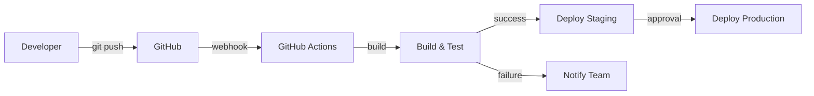

# CI/CD Pipeline - Automação de Deploy

**Best Practices de Integração e Entrega Contínua**

---

## 🎯 Visão Geral

Um pipeline CI/CD automatiza o processo de build, teste e deploy de aplicações, garantindo qualidade e velocidade de entrega.

### Fluxo Geral



---

## 🚀 Pipeline do QuintoAndar (Referência)

### Ciclo Semanal

| Dia | Atividade | Responsável |
|-----|-----------|-------------|
| **Segunda-Quinta** | Desenvolvimento, PRs, merges | Desenvolvedores |
| **Sexta (manhã)** | Geração do Release Candidate | CI/CD automático |
| **Sexta (tarde)** | Análise de saúde, decisão go/no-go | Tech Lead + PM |
| **Segunda** | Deploy gradual (10% → 100%) | CI/CD + monitoramento |

### Características

- ✅ **Feature Flags:** Código em produção, features inativas
- ✅ **AI Code Review:** Análise automática de qualidade
- ✅ **Testes Nightly:** E2E completos no branch principal
- ✅ **Rollout Gradual:** 10% → 25% → 50% → 100%
- ✅ **Hotfix Rápido:** Deploy em minutos se necessário

### Pirâmide de Testes

```
        E2E Tests (>50)
       ╱              ╲
    UI Tests (~90)
  ╱                    ╲
Unit Tests (milhares)
```

---

## 🏗️ CI/CD para GoCasa360IT

### Arquitetura Atual vs Recomendada

| Etapa | Atual | Recomendado |
|-------|-------|-------------|
| **Source Control** | ✅ Git + GitHub | ✅ Manter |
| **CI** | ❌ Não implementado | 🔴 GitHub Actions |
| **Tests** | ❌ Não implementado | 🔴 Vitest + Playwright |
| **Build** | ⚠️ Manual (npm run build) | 🔴 Automático |
| **Deploy** | ⚠️ Manual (wrangler) | 🔴 Automático |
| **Monitoring** | ❌ Não implementado | 🟡 Better Stack / Axiom |

---

## 📋 GitHub Actions Workflow (Completo)

### 1. Backend CI/CD

```yaml
# .github/workflows/backend-ci-cd.yml
name: Backend CI/CD

on:
  push:
    branches: [main, develop]
    paths:
      - 'src/**'
      - 'package.json'
      - 'wrangler.jsonc'
  pull_request:
    branches: [main, develop]

env:
  NODE_VERSION: '18'

jobs:
  lint-and-typecheck:
    name: Lint & Type Check
    runs-on: ubuntu-latest
    steps:
      - uses: actions/checkout@v4
      
      - name: Setup Node.js
        uses: actions/setup-node@v4
        with:
          node-version: ${{ env.NODE_VERSION }}
          cache: 'npm'
      
      - name: Install dependencies
        run: npm ci
      
      - name: Run ESLint
        run: npm run lint
      
      - name: TypeScript type check
        run: npm run type-check

  test:
    name: Unit & Integration Tests
    runs-on: ubuntu-latest
    needs: lint-and-typecheck
    steps:
      - uses: actions/checkout@v4
      
      - name: Setup Node.js
        uses: actions/setup-node@v4
        with:
          node-version: ${{ env.NODE_VERSION }}
          cache: 'npm'
      
      - name: Install dependencies
        run: npm ci
      
      - name: Run unit tests
        run: npm run test:unit
      
      - name: Run integration tests
        run: npm run test:integration
        env:
          DATABASE_URL: ${{ secrets.TEST_DATABASE_URL }}
      
      - name: Generate coverage report
        run: npm run test:coverage
      
      - name: Upload coverage to Codecov
        uses: codecov/codecov-action@v3
        with:
          token: ${{ secrets.CODECOV_TOKEN }}
          files: ./coverage/coverage-final.json

  security:
    name: Security Scan
    runs-on: ubuntu-latest
    steps:
      - uses: actions/checkout@v4
      
      - name: Run npm audit
        run: npm audit --audit-level=high
      
      - name: Run Snyk security scan
        uses: snyk/actions/node@master
        env:
          SNYK_TOKEN: ${{ secrets.SNYK_TOKEN }}
        with:
          args: --severity-threshold=high

  build:
    name: Build Application
    runs-on: ubuntu-latest
    needs: [test, security]
    steps:
      - uses: actions/checkout@v4
      
      - name: Setup Node.js
        uses: actions/setup-node@v4
        with:
          node-version: ${{ env.NODE_VERSION }}
          cache: 'npm'
      
      - name: Install dependencies
        run: npm ci
      
      - name: Build application
        run: npm run build
      
      - name: Upload build artifacts
        uses: actions/upload-artifact@v3
        with:
          name: dist
          path: dist/
          retention-days: 7

  deploy-staging:
    name: Deploy to Staging
    runs-on: ubuntu-latest
    needs: build
    if: github.ref == 'refs/heads/develop'
    environment:
      name: staging
      url: https://staging.gocasa360it.pages.dev
    steps:
      - uses: actions/checkout@v4
      
      - name: Setup Node.js
        uses: actions/setup-node@v4
        with:
          node-version: ${{ env.NODE_VERSION }}
      
      - name: Download build artifacts
        uses: actions/download-artifact@v3
        with:
          name: dist
          path: dist/
      
      - name: Deploy to Cloudflare Pages (Staging)
        uses: cloudflare/wrangler-action@v3
        with:
          apiToken: ${{ secrets.CLOUDFLARE_API_TOKEN }}
          accountId: ${{ secrets.CLOUDFLARE_ACCOUNT_ID }}
          command: pages deploy dist --project-name gocasa360it --branch staging
      
      - name: Run smoke tests
        run: npm run test:smoke
        env:
          BASE_URL: https://staging.gocasa360it.pages.dev

  deploy-production:
    name: Deploy to Production
    runs-on: ubuntu-latest
    needs: build
    if: github.ref == 'refs/heads/main'
    environment:
      name: production
      url: https://gocasa360it.pages.dev
    steps:
      - uses: actions/checkout@v4
      
      - name: Setup Node.js
        uses: actions/setup-node@v4
        with:
          node-version: ${{ env.NODE_VERSION }}
      
      - name: Download build artifacts
        uses: actions/download-artifact@v3
        with:
          name: dist
          path: dist/
      
      - name: Apply D1 migrations
        uses: cloudflare/wrangler-action@v3
        with:
          apiToken: ${{ secrets.CLOUDFLARE_API_TOKEN }}
          accountId: ${{ secrets.CLOUDFLARE_ACCOUNT_ID }}
          command: d1 migrations apply gocasa360it-production --remote
      
      - name: Deploy to Cloudflare Pages (Production)
        uses: cloudflare/wrangler-action@v3
        with:
          apiToken: ${{ secrets.CLOUDFLARE_API_TOKEN }}
          accountId: ${{ secrets.CLOUDFLARE_ACCOUNT_ID }}
          command: pages deploy dist --project-name gocasa360it --branch main
      
      - name: Run smoke tests
        run: npm run test:smoke
        env:
          BASE_URL: https://gocasa360it.pages.dev
      
      - name: Notify deployment success
        uses: slackapi/slack-github-action@v1
        with:
          webhook-url: ${{ secrets.SLACK_WEBHOOK }}
          payload: |
            {
              "text": "✅ GoCasa360IT deployed to production successfully!",
              "blocks": [
                {
                  "type": "section",
                  "text": {
                    "type": "mrkdwn",
                    "text": "*Deployment Status:* Success\n*Environment:* Production\n*Commit:* ${{ github.sha }}\n*URL:* https://gocasa360it.pages.dev"
                  }
                }
              ]
            }
```

---

### 2. End-to-End Tests Workflow

```yaml
# .github/workflows/e2e-tests.yml
name: E2E Tests

on:
  schedule:
    - cron: '0 2 * * *' # Run daily at 2 AM UTC
  workflow_dispatch: # Manual trigger
  push:
    branches: [main]

jobs:
  e2e-tests:
    name: Playwright E2E Tests
    runs-on: ubuntu-latest
    strategy:
      matrix:
        browser: [chromium, firefox, webkit]
    steps:
      - uses: actions/checkout@v4
      
      - name: Setup Node.js
        uses: actions/setup-node@v4
        with:
          node-version: '18'
      
      - name: Install dependencies
        run: npm ci
      
      - name: Install Playwright browsers
        run: npx playwright install --with-deps ${{ matrix.browser }}
      
      - name: Run Playwright tests
        run: npx playwright test --project=${{ matrix.browser }}
        env:
          BASE_URL: https://staging.gocasa360it.pages.dev
      
      - name: Upload test results
        if: always()
        uses: actions/upload-artifact@v3
        with:
          name: playwright-report-${{ matrix.browser }}
          path: playwright-report/
          retention-days: 30
      
      - name: Notify on failure
        if: failure()
        uses: slackapi/slack-github-action@v1
        with:
          webhook-url: ${{ secrets.SLACK_WEBHOOK }}
          payload: |
            {
              "text": "❌ E2E tests failed on ${{ matrix.browser }}!",
              "blocks": [
                {
                  "type": "section",
                  "text": {
                    "type": "mrkdwn",
                    "text": "*Test Status:* Failed\n*Browser:* ${{ matrix.browser }}\n*Commit:* ${{ github.sha }}"
                  }
                }
              ]
            }
```

---

### 3. Database Migration Workflow

```yaml
# .github/workflows/db-migrations.yml
name: Database Migrations

on:
  workflow_dispatch:
    inputs:
      environment:
        description: 'Target environment'
        required: true
        type: choice
        options:
          - staging
          - production

jobs:
  apply-migrations:
    name: Apply D1 Migrations
    runs-on: ubuntu-latest
    environment: ${{ github.event.inputs.environment }}
    steps:
      - uses: actions/checkout@v4
      
      - name: Setup Node.js
        uses: actions/setup-node@v4
        with:
          node-version: '18'
      
      - name: Install Wrangler
        run: npm install -g wrangler
      
      - name: Apply migrations to ${{ github.event.inputs.environment }}
        uses: cloudflare/wrangler-action@v3
        with:
          apiToken: ${{ secrets.CLOUDFLARE_API_TOKEN }}
          accountId: ${{ secrets.CLOUDFLARE_ACCOUNT_ID }}
          command: d1 migrations apply gocasa360it-${{ github.event.inputs.environment }} --remote
      
      - name: Verify migration
        run: |
          wrangler d1 execute gocasa360it-${{ github.event.inputs.environment }} \
            --remote \
            --command="SELECT name FROM sqlite_master WHERE type='table';"
```

---

## 🧪 Estrutura de Testes

### package.json Scripts

```json
{
  "scripts": {
    "dev": "wrangler pages dev dist --ip 0.0.0.0 --port 3000",
    "build": "vite build",
    "deploy": "wrangler pages deploy dist --project-name gocasa360it",
    
    "lint": "eslint src --ext .ts,.tsx",
    "lint:fix": "eslint src --ext .ts,.tsx --fix",
    "type-check": "tsc --noEmit",
    
    "test": "vitest",
    "test:unit": "vitest run --coverage",
    "test:integration": "vitest run --config vitest.integration.config.ts",
    "test:e2e": "playwright test",
    "test:smoke": "playwright test --grep @smoke",
    "test:coverage": "vitest run --coverage",
    "test:watch": "vitest watch",
    
    "db:migrate:local": "wrangler d1 migrations apply gocasa360it-production --local",
    "db:migrate:prod": "wrangler d1 migrations apply gocasa360it-production --remote",
    "db:seed": "wrangler d1 execute gocasa360it-production --local --file=./seed.sql",
    "db:reset": "rm -rf .wrangler/state/v3/d1 && npm run db:migrate:local && npm run db:seed"
  }
}
```

### Exemplo de Teste Unitário (Vitest)

```typescript
// src/routes/__tests__/auth.test.ts
import { describe, it, expect, beforeEach } from 'vitest'
import { Hono } from 'hono'
import auth from '../auth'

describe('Auth Routes', () => {
  let app: Hono

  beforeEach(() => {
    app = new Hono()
    app.route('/api/auth', auth)
  })

  describe('POST /api/auth/register', () => {
    it('should register a new user', async () => {
      const res = await app.request('/api/auth/register', {
        method: 'POST',
        body: JSON.stringify({
          email: 'test@example.com',
          senha: 'Password123!',
          nome_completo: 'Test User',
          tipo: 'inquilino'
        }),
        headers: {
          'Content-Type': 'application/json'
        }
      })

      expect(res.status).toBe(200)
      const data = await res.json()
      expect(data.success).toBe(true)
      expect(data.data.user.email).toBe('test@example.com')
      expect(data.data.token).toBeDefined()
    })

    it('should reject invalid email', async () => {
      const res = await app.request('/api/auth/register', {
        method: 'POST',
        body: JSON.stringify({
          email: 'invalid-email',
          senha: 'Password123!',
          nome_completo: 'Test User',
          tipo: 'inquilino'
        }),
        headers: {
          'Content-Type': 'application/json'
        }
      })

      expect(res.status).toBe(400)
      const data = await res.json()
      expect(data.success).toBe(false)
      expect(data.message).toContain('Email inválido')
    })
  })
})
```

### Exemplo de Teste E2E (Playwright)

```typescript
// tests/e2e/auth.spec.ts
import { test, expect } from '@playwright/test'

test.describe('Authentication Flow', () => {
  test('should register a new user @smoke', async ({ page }) => {
    await page.goto('/')
    
    // Click "Cadastrar"
    await page.click('text=Cadastrar')
    
    // Fill registration form
    await page.fill('input[name="nome_completo"]', 'Test User')
    await page.fill('input[name="email"]', `test-${Date.now()}@example.com`)
    await page.fill('input[name="telefone"]', '+39 123 456 7890')
    await page.fill('input[name="senha"]', 'Password123!')
    await page.fill('input[name="senha_confirmacao"]', 'Password123!')
    await page.selectOption('select[name="tipo"]', 'inquilino')
    
    // Submit form
    await page.click('button[type="submit"]')
    
    // Wait for redirect
    await page.waitForURL('/imoveis')
    
    // Verify success
    await expect(page.locator('text=Buscar Imóveis')).toBeVisible()
  })

  test('should login existing user', async ({ page }) => {
    await page.goto('/login')
    
    await page.fill('input[name="email"]', 'admin@gocasa360it.com')
    await page.fill('input[name="senha"]', 'Admin@2025')
    await page.click('button[type="submit"]')
    
    await page.waitForURL('/admin')
    await expect(page.locator('text=Dashboard Admin')).toBeVisible()
  })
})
```

---

## 🔒 Secrets Management

### GitHub Secrets Necessários

```
CLOUDFLARE_API_TOKEN       # Token da API Cloudflare
CLOUDFLARE_ACCOUNT_ID      # ID da conta Cloudflare
CODECOV_TOKEN              # Token do Codecov (coverage)
SNYK_TOKEN                 # Token do Snyk (security scan)
SLACK_WEBHOOK              # Webhook do Slack (notificações)
TEST_DATABASE_URL          # URL do banco de testes
```

### Configurar via GitHub CLI

```bash
gh secret set CLOUDFLARE_API_TOKEN
gh secret set CLOUDFLARE_ACCOUNT_ID
gh secret set CODECOV_TOKEN
gh secret set SNYK_TOKEN
gh secret set SLACK_WEBHOOK
```

---

## 📊 Monitoramento de CI/CD

### Métricas Chave

| Métrica | Target | Ação se Exceder |
|---------|--------|-----------------|
| Build Time | < 3 min | Otimizar build, paralelizar |
| Test Time | < 5 min | Reduzir testes, otimizar |
| Deploy Time | < 2 min | Investigar bottlenecks |
| Success Rate | > 95% | Revisar código, melhorar testes |

### Dashboard Recomendado

```
GitHub Actions Dashboard:
- Build success rate (última semana)
- Average build time
- Flaky tests (testes instáveis)
- Deployment frequency
- MTTR (Mean Time To Recovery)
```

---

## 🚀 Próximos Passos para GoCasa360IT

### Prioridade ALTA (Implementar primeiro)

1. **✅ Configurar GitHub Actions básico**
   - Lint + Type Check
   - Build automático
   - Deploy para staging/production

2. **✅ Adicionar testes unitários (Vitest)**
   - Testar rotas críticas (auth, imoveis)
   - Cobertura mínima 50%

3. **✅ Implementar testes E2E (Playwright)**
   - Fluxo de registro/login
   - Busca de imóveis
   - Agendamento de visita

### Prioridade MÉDIA (Próximos 3 meses)

4. **Configurar monitoramento**
   - Better Stack ou Axiom
   - Alertas de erro

5. **Security scanning**
   - Snyk ou Dependabot
   - Auditorias automáticas

### Prioridade BAIXA (Futuro)

6. **Feature flags**
   - LaunchDarkly ou CloudFlare feature flags
7. **Rollout gradual**
   - Canary deployments
8. **Performance budgets**
   - Lighthouse CI

---

## 🔗 Documentos Relacionados

- [Arquitetura de Microserviços](./ARQUITETURA_MICROSERVICOS.md)
- [Stack Tecnológico](./STACK_TECNOLOGICO.md)
- [Proptech Workflow](./PROPTECH_WORKFLOW.md)
- [Comparação GoCasa360](./COMPARACAO_GOCASA360.md)
