# 📋 Definition of Ready (DoR) - Análise de Diagramas Faltantes

**Análise Completa dos Fluxos que Precisam ser Documentados**

---

## 📊 Status Atual da Documentação

### ✅ Diagramas Existentes (4 totais)

| Arquivo | Diagramas | Tipo |
|---------|-----------|------|
| **ARQUITETURA_MICROSERVICOS.md** | 2 | Arquitetura geral + Sequence diagram |
| **CI_CD_PIPELINE.md** | 1 | Fluxo CI/CD |
| **STACK_TECNOLOGICO.md** | 1 | Migração gradual |
| **Total** | **4 diagramas** | Mermaid |

### ❌ Diagramas Faltantes (18 identificados)

---

## 🚨 CRÍTICOS - Definition of Ready (DoR)

### 1. **Fluxos de Usuário (User Flows)** - 8 diagramas

#### 1.1 Fluxo de Registro/Cadastro (Inquilino)
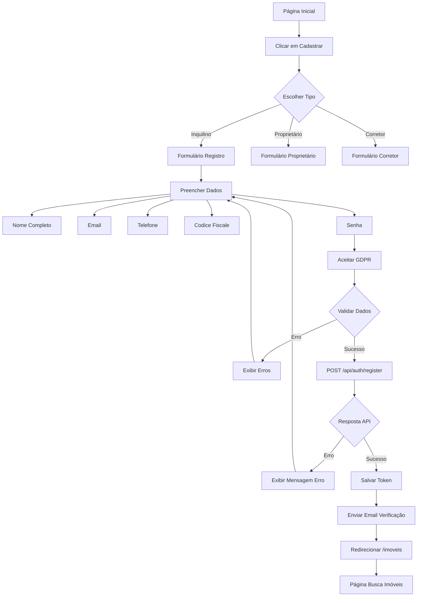

**Status**: ❌ **Não existe**  
**Prioridade**: 🔥 **CRÍTICA**  
**Motivo**: Fluxo core do produto, essencial para DoR

---

#### 1.2 Fluxo de Login
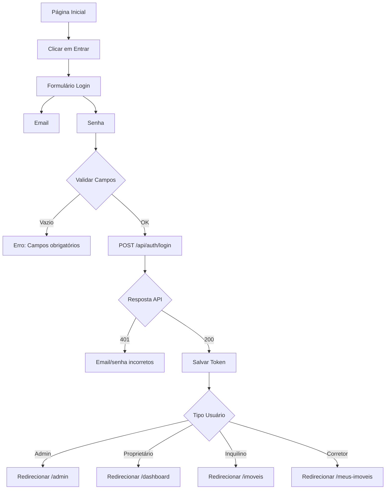

**Status**: ❌ **Não existe**  
**Prioridade**: 🔥 **CRÍTICA**

---

#### 1.3 Fluxo de Busca de Imóveis
```mermaid
graph TD
    A[Página Inicial] --> B[Barra de Busca]
    B --> C[Digite Localização]
    
    C --> D{Google Places Autocomplete}
    D --> E[Sugestões de Endereços]
    E --> F[Selecionar Endereço]
    
    F --> G[Aplicar Filtros]
    G --> H[Tipo: Apartamento/Casa]
    G --> I[Finalidade: Aluguel/Venda]
    G --> J[Preço: Min/Max]
    G --> K[Quartos: 1,2,3,4+]
    G --> L[Área m²: Range]
    
    L --> M[GET /api/imoveis?filters]
    M --> N{Resultados}
    
    N -->|Vazio| O[Nenhum imóvel encontrado]
    N -->|Lista| P[Grid 3 Colunas]
    
    P --> Q[Card Imóvel]
    Q --> R[Foto Capa]
    Q --> S[Título]
    Q --> T[Preço]
    Q --> U[Localização]
    Q --> V[Características]
    
    V --> W[Clicar no Card]
    W --> X[/imoveis/:id]
```

**Status**: ❌ **Não existe**  
**Prioridade**: 🔥 **CRÍTICA**

---

#### 1.4 Fluxo de Cadastro de Imóvel (Wizard 5 Etapas)
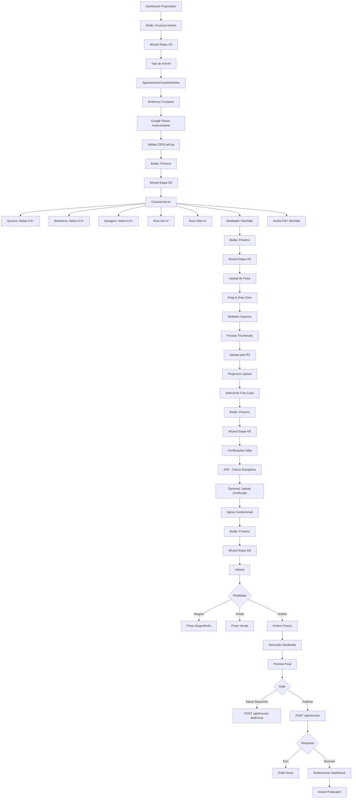

**Status**: ❌ **Não existe**  
**Prioridade**: 🔥 **CRÍTICA** (SEM ISSO, NÃO HÁ PLATAFORMA)

---

#### 1.5 Fluxo de Agendamento de Visita
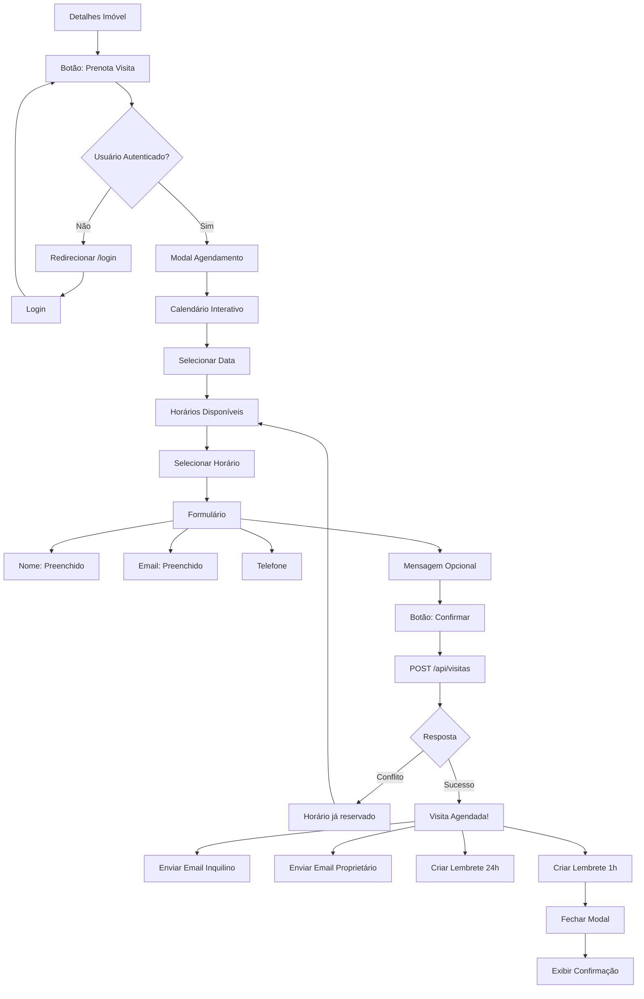

**Status**: ❌ **Não existe**  
**Prioridade**: 🔥 **ALTA**

---

#### 1.6 Fluxo de Chat/Mensagens
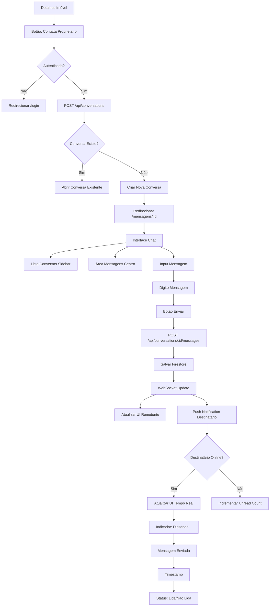

**Status**: ❌ **Não existe**  
**Prioridade**: 🔥 **ALTA**

---

#### 1.7 Fluxo de Favoritos
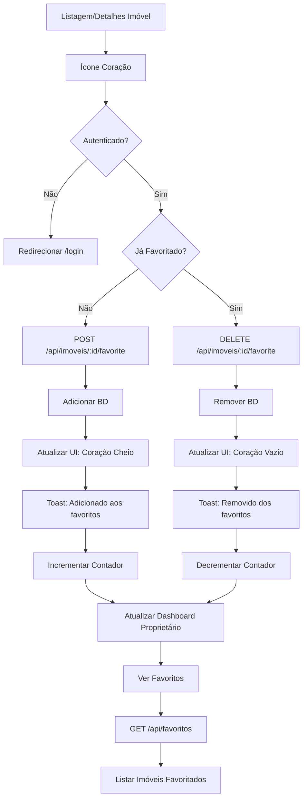

**Status**: ❌ **Não existe**  
**Prioridade**: 🟡 **MÉDIA**

---

#### 1.8 Fluxo de Dashboard Proprietário
```mermaid
graph TD
    A[Login Proprietário] --> B[Redirecionar /dashboard]
    B --> C[GET /api/imoveis?proprietario_id]
    
    C --> D[Dashboard Layout]
    D --> E[Cards Métricas]
    E --> F[Total Imóveis]
    E --> G[Visualizações 30d]
    E --> H[Favoritos]
    E --> I[Visitas Agendadas]
    E --> J[Mensagens Não Lidas]
    
    J --> K[Lista de Imóveis]
    K --> L[Tabela/Cards]
    L --> M[Foto Capa]
    L --> N[Título]
    L --> O[Status: Ativo/Pausado]
    L --> P[Visualizações]
    L --> Q[Favoritos]
    L --> R[Ações]
    
    R --> S[Botão: Ver]
    R --> T[Botão: Editar]
    R --> U[Botão: Pausar/Reativar]
    R --> V[Botão: Excluir]
    
    S --> W[/imoveis/:id]
    T --> X[Wizard Edição]
    U --> Y[PUT /api/imoveis/:id status]
    V --> Z{Confirmar Exclusão?}
    Z -->|Sim| AA[DELETE /api/imoveis/:id]
    Z -->|Não| K
    
    AA --> AB[Atualizar Lista]
    Y --> AB
```

**Status**: ❌ **Não existe**  
**Prioridade**: 🔥 **ALTA**

---

## 🔄 Fluxos de Sistema (Backend) - 5 diagramas

### 2. **Fluxos de Integração**

#### 2.1 Fluxo de Upload de Fotos (Cloudflare R2)
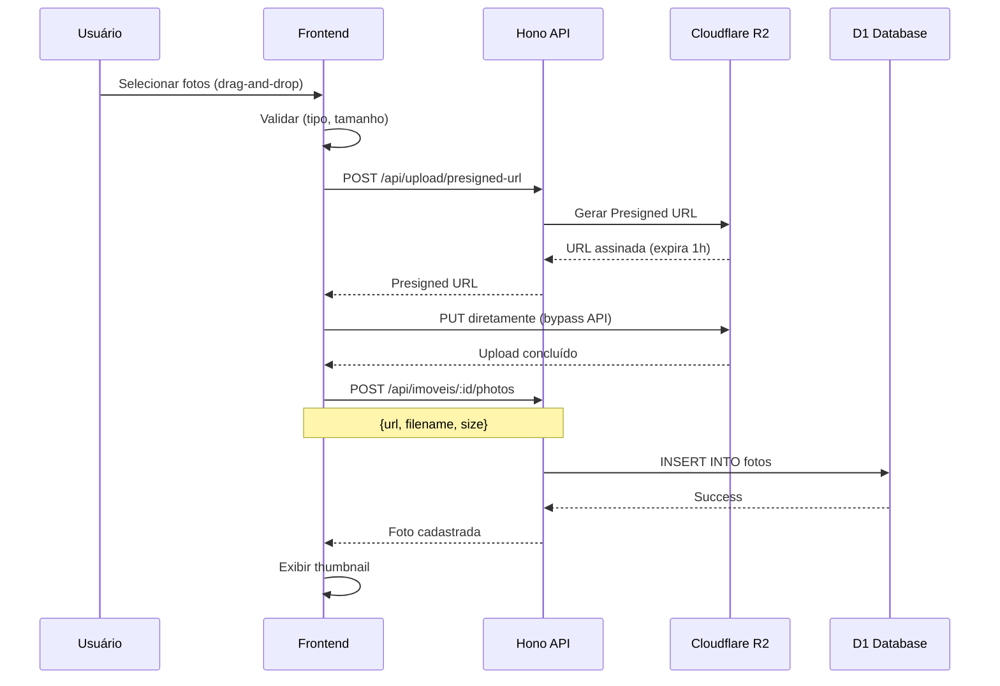

**Status**: ❌ **Não existe**  
**Prioridade**: 🔥 **CRÍTICA**

---

#### 2.2 Fluxo de Integração Google Maps
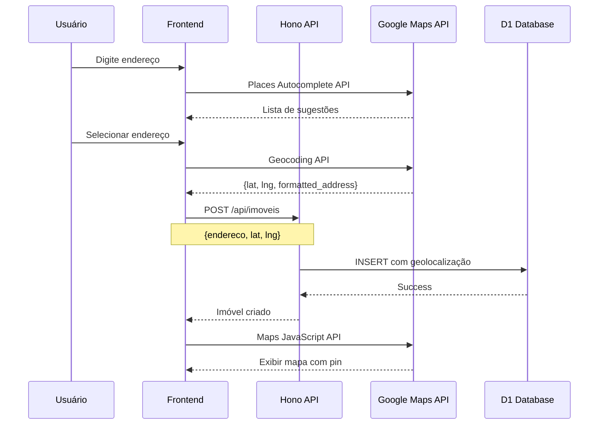

**Status**: ❌ **Não existe**  
**Prioridade**: 🔥 **CRÍTICA**

---

#### 2.3 Fluxo de Envio de Emails (SendGrid)
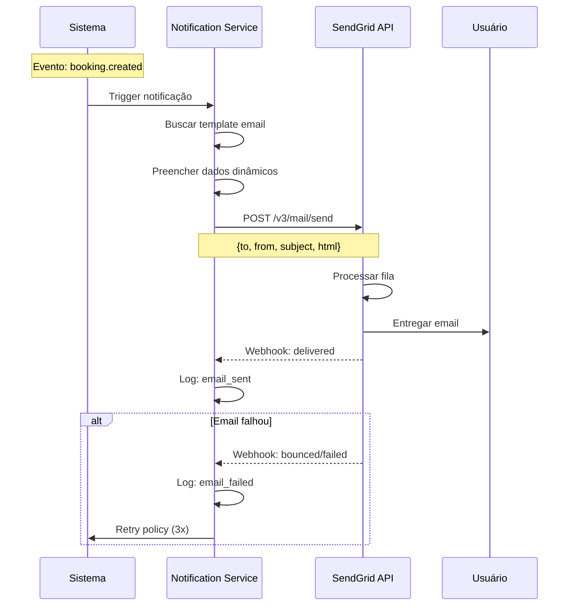

**Status**: ❌ **Não existe**  
**Prioridade**: 🔥 **ALTA**

---

#### 2.4 Fluxo de Autenticação Social (Google OAuth)
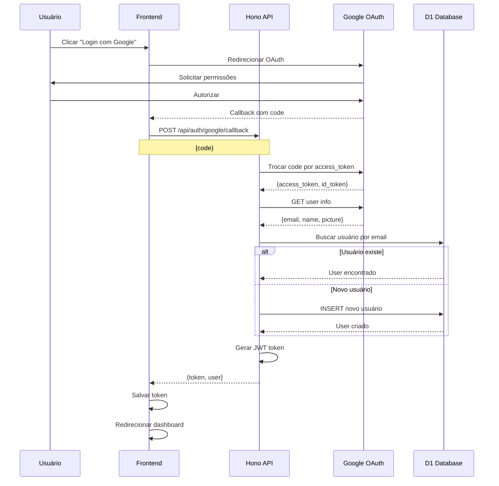

**Status**: ❌ **Não existe**  
**Prioridade**: 🟡 **MÉDIA**

---

#### 2.5 Fluxo de Chat Real-time (Firebase Firestore)
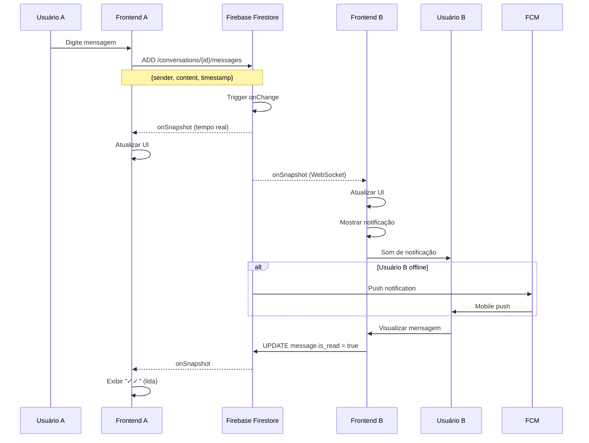

**Status**: ❌ **Não existe**  
**Prioridade**: 🔥 **ALTA**

---

## 📊 Fluxos de Dados (Data Flow) - 3 diagramas

### 3. **Fluxos de Processamento de Dados**

#### 3.1 Fluxo de Busca com Filtros
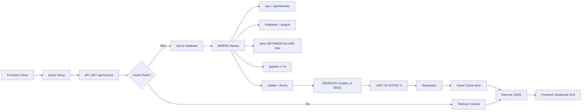

**Status**: ❌ **Não existe**  
**Prioridade**: 🟡 **MÉDIA**

---

#### 3.2 Fluxo de Geolocalização e Busca por Proximidade
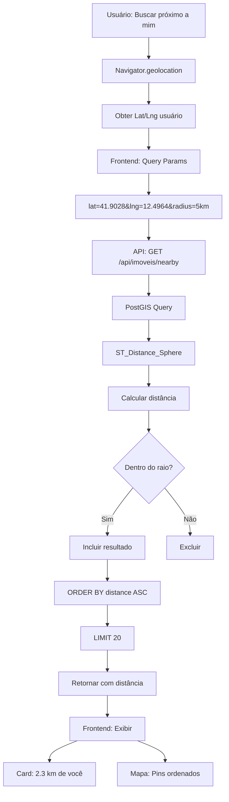

**Status**: ❌ **Não existe**  
**Prioridade**: 🟡 **MÉDIA**

---

#### 3.3 Fluxo de Análise de Crédito (Futuro - Fase 2)
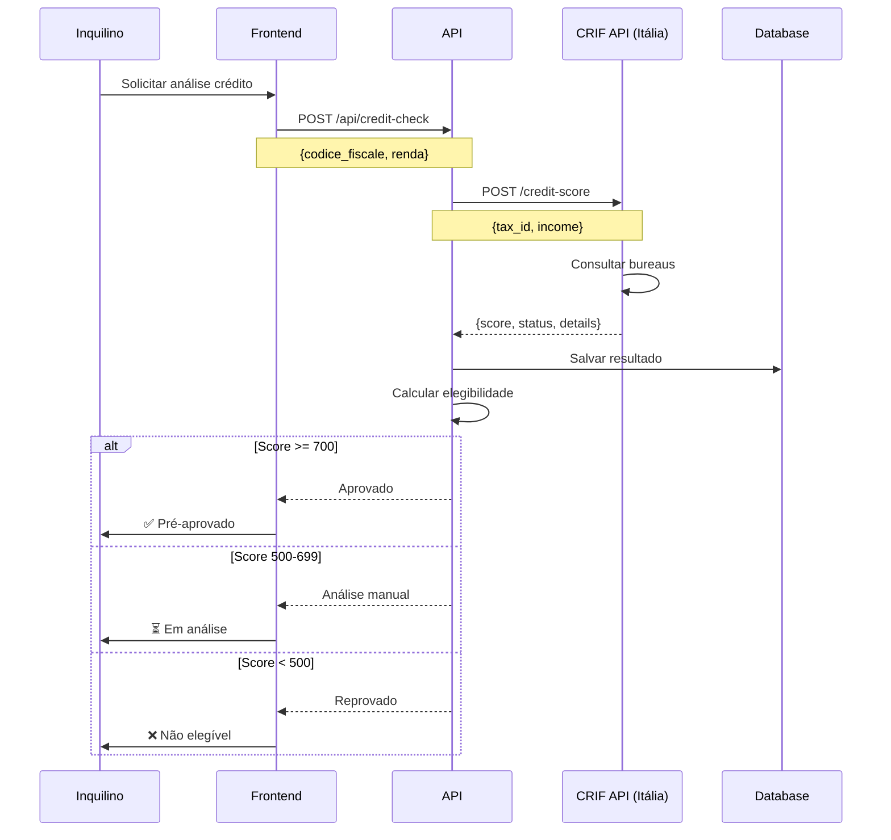

**Status**: ❌ **Não existe** (Fase 2)  
**Prioridade**: 🟢 **BAIXA** (Pós-MVP)

---

## 🛡️ Fluxos de Segurança (Security) - 2 diagramas

### 4. **Fluxos de Segurança e Conformidade**

#### 4.1 Fluxo de GDPR Consent
```mermaid
graph TD
    A[Registro Usuário] --> B[Formulário]
    B --> C[Checkboxes GDPR]
    C --> D[Marketing: Opcional]
    C --> E[Analytics: Opcional]
    C --> F[Third-party: Opcional]
    C --> G[Necessário: Obrigatório checked]
    
    G --> H{Aceitar Necessário?}
    H -->|Não| I[Bloquear Submit]
    I --> J[Erro: Consentimento obrigatório]
    
    H -->|Sim| K[POST /api/auth/register]
    K --> L[Salvar Usuário]
    L --> M[POST /api/gdpr/consent]
    
    M --> N[Salvar Consent]
    N --> O[gdpr_consents table]
    O --> P[user_id, purposes, ip, timestamp]
    
    P --> Q[gdpr_consent_history]
    Q --> R[Log de alterações]
    
    R --> S[Email Confirmação]
    S --> T[Link: Gerenciar Preferências]
    
    T --> U[/settings/privacy]
    U --> V[Toggle Preferências]
    V --> W[PUT /api/gdpr/consent]
    W --> Q
```

**Status**: ⚠️ **Parcial** (backend existe, frontend incompleto)  
**Prioridade**: 🔥 **ALTA**

---

#### 4.2 Fluxo de Recuperação de Senha
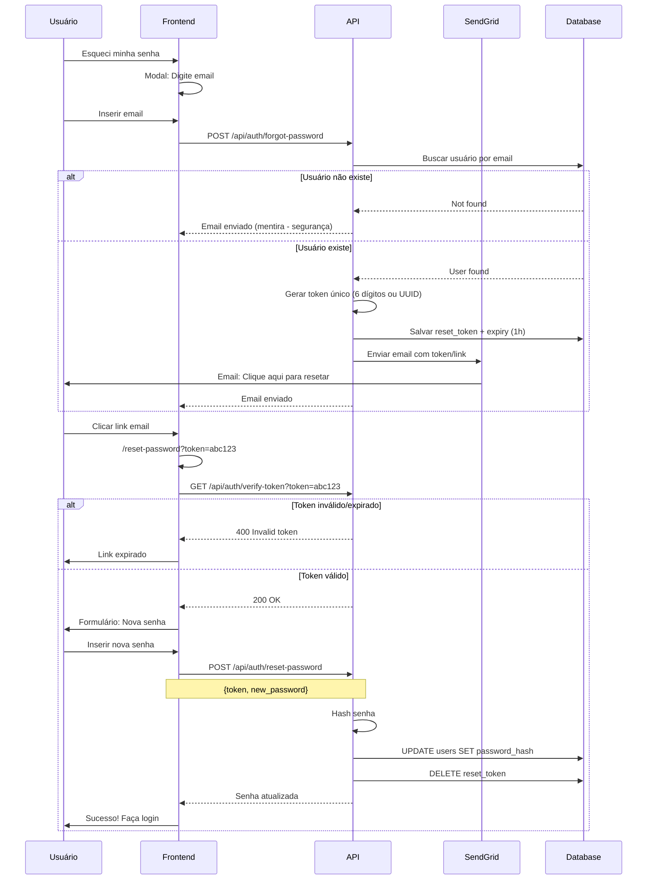

**Status**: ❌ **Não existe**  
**Prioridade**: 🔥 **ALTA**

---

## 📋 Resumo de Diagramas Faltantes

| # | Diagrama | Tipo | Prioridade | Status | Arquivo Destino |
|---|----------|------|------------|--------|-----------------|
| 1 | Fluxo Registro Inquilino | User Flow | 🔥 CRÍTICA | ❌ | FLUXOS_USUARIO.md |
| 2 | Fluxo Login | User Flow | 🔥 CRÍTICA | ❌ | FLUXOS_USUARIO.md |
| 3 | Fluxo Busca Imóveis | User Flow | 🔥 CRÍTICA | ❌ | FLUXOS_USUARIO.md |
| 4 | Fluxo Cadastro Imóvel (Wizard) | User Flow | 🔥 CRÍTICA | ❌ | FLUXOS_USUARIO.md |
| 5 | Fluxo Agendamento Visita | User Flow | 🔥 ALTA | ❌ | FLUXOS_USUARIO.md |
| 6 | Fluxo Chat/Mensagens | User Flow | 🔥 ALTA | ❌ | FLUXOS_USUARIO.md |
| 7 | Fluxo Favoritos | User Flow | 🟡 MÉDIA | ❌ | FLUXOS_USUARIO.md |
| 8 | Fluxo Dashboard Proprietário | User Flow | 🔥 ALTA | ❌ | FLUXOS_USUARIO.md |
| 9 | Integração Upload Fotos (R2) | Integration | 🔥 CRÍTICA | ❌ | FLUXOS_INTEGRACAO.md |
| 10 | Integração Google Maps | Integration | 🔥 CRÍTICA | ❌ | FLUXOS_INTEGRACAO.md |
| 11 | Integração SendGrid | Integration | 🔥 ALTA | ❌ | FLUXOS_INTEGRACAO.md |
| 12 | Integração Google OAuth | Integration | 🟡 MÉDIA | ❌ | FLUXOS_INTEGRACAO.md |
| 13 | Integração Firebase Chat | Integration | 🔥 ALTA | ❌ | FLUXOS_INTEGRACAO.md |
| 14 | Data Flow: Busca Filtros | Data Flow | 🟡 MÉDIA | ❌ | FLUXOS_DADOS.md |
| 15 | Data Flow: Geolocalização | Data Flow | 🟡 MÉDIA | ❌ | FLUXOS_DADOS.md |
| 16 | Data Flow: Análise Crédito | Data Flow | 🟢 BAIXA | ❌ | FLUXOS_DADOS.md |
| 17 | Security: GDPR Consent | Security | 🔥 ALTA | ⚠️ | FLUXOS_SEGURANCA.md |
| 18 | Security: Recuperação Senha | Security | 🔥 ALTA | ❌ | FLUXOS_SEGURANCA.md |

---

## 🎯 Estrutura de Arquivos Recomendada

```
/home/user/webapp/docs/
├── README.md                          ✅ Existe
├── PROPTECH_WORKFLOW.md               ✅ Existe
├── ARQUITETURA_MICROSERVICOS.md       ✅ Existe (2 diagramas)
├── STACK_TECNOLOGICO.md               ✅ Existe (1 diagrama)
├── CI_CD_PIPELINE.md                  ✅ Existe (1 diagrama)
├── COMPARACAO_GOCASA360.md            ✅ Existe
├── DoR_ANALISE.md                     ✅ Este arquivo
├── FLUXOS_USUARIO.md                  ❌ CRIAR (8 diagramas)
├── FLUXOS_INTEGRACAO.md               ❌ CRIAR (5 diagramas)
├── FLUXOS_DADOS.md                    ❌ CRIAR (3 diagramas)
└── FLUXOS_SEGURANCA.md                ❌ CRIAR (2 diagramas)
```

---

## 🔥 Priorização para Definition of Ready (DoR)

### **Sprint 0 (Documentação - 1 semana):**

#### Prioridade CRÍTICA (Fazer AGORA):
1. ✅ **FLUXOS_USUARIO.md** (8 diagramas)
   - Fluxo Registro
   - Fluxo Login
   - Fluxo Busca
   - Fluxo Cadastro Imóvel (Wizard)
   - Fluxo Agendamento
   - Fluxo Chat
   - Fluxo Dashboard

2. ✅ **FLUXOS_INTEGRACAO.md** (5 diagramas)
   - Upload Fotos R2
   - Google Maps
   - SendGrid

#### Prioridade ALTA (Próxima semana):
3. ✅ **FLUXOS_SEGURANCA.md** (2 diagramas)
   - GDPR Consent
   - Recuperação Senha

#### Prioridade MÉDIA (Quando houver tempo):
4. ✅ **FLUXOS_DADOS.md** (3 diagramas)
   - Busca com Filtros
   - Geolocalização

---

## 💡 Benefícios de Ter DoR Completo

### Para Desenvolvedores:
✅ Entendimento claro de cada fluxo  
✅ Redução de dúvidas durante implementação  
✅ Referência rápida para edge cases  
✅ Facilita onboarding de novos devs

### Para Product Managers:
✅ Visualização completa das jornadas  
✅ Identificação de gaps antes de codificar  
✅ Melhor estimativa de esforço  
✅ Comunicação clara com stakeholders

### Para QA:
✅ Base para criação de test cases  
✅ Cobertura de cenários positivos/negativos  
✅ Identificação de pontos de falha  
✅ Documentação de comportamento esperado

### Para Designers:
✅ Entendimento de fluxos completos  
✅ Identificação de pontos de fricção  
✅ Sincronização com desenvolvimento  
✅ Validação de wireframes contra fluxos

---

## 🚀 Próximos Passos

1. **Criar FLUXOS_USUARIO.md** com 8 diagramas de user flows
2. **Criar FLUXOS_INTEGRACAO.md** com 5 diagramas de integrações externas
3. **Criar FLUXOS_SEGURANCA.md** com 2 diagramas de segurança
4. **Criar FLUXOS_DADOS.md** com 3 diagramas de data flows
5. **Atualizar README.md** com links para novos documentos

**Tempo estimado**: 1-2 dias de documentação  
**Benefício**: DoR 100% completo para início de desenvolvimento

---

**Última atualização**: 28/12/2025  
**Versão**: 1.0  
**Próxima ação**: Criar FLUXOS_USUARIO.md
