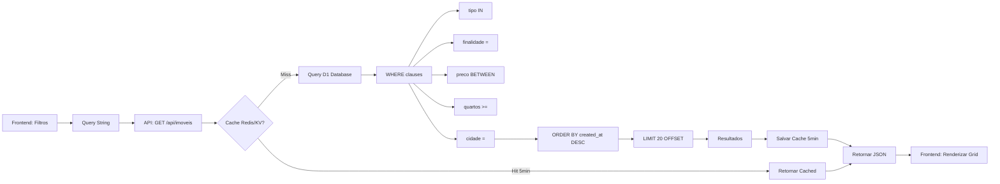
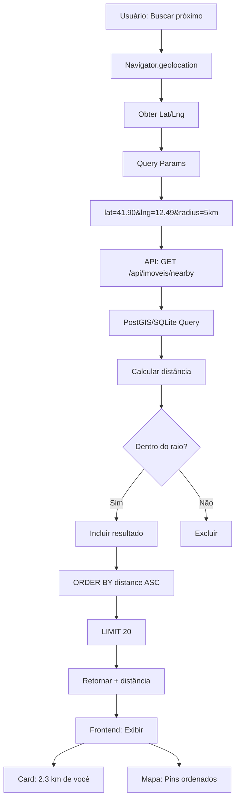
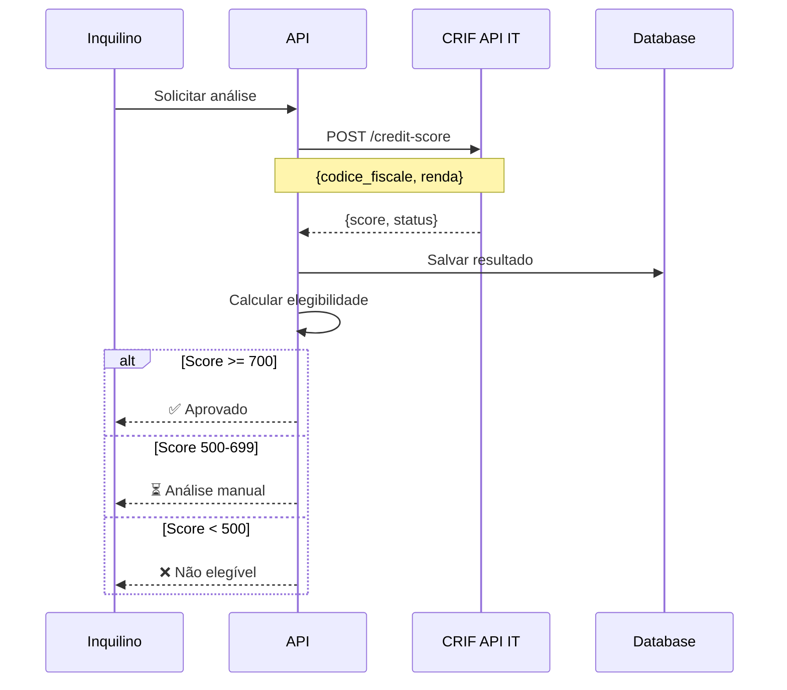

# 📊 Fluxos de Dados - GoCasa360IT

**Data Processing e Analytics**

---

## 1. Fluxo de Busca com Filtros e Cache

### 📊 Diagrama



### ✅ Otimizações
- ✅ Cache de 5 minutos (Cloudflare KV)
- ✅ Índices em colunas filtradas
- ✅ Paginação (20 resultados)
- ✅ Query optimizada (SELECT apenas colunas necessárias)

---

## 2. Fluxo de Geolocalização (Busca por Proximidade)

### 📊 Diagrama



### 🗺️ SQL Query (SQLite)

```sql
SELECT *,
  (6371 * acos(cos(radians(?)) * cos(radians(endereco_latitude)) * 
   cos(radians(endereco_longitude) - radians(?)) + 
   sin(radians(?)) * sin(radians(endereco_latitude)))) AS distance
FROM imoveis
WHERE disponivel = 1
HAVING distance < ?
ORDER BY distance ASC
LIMIT 20
```

---

## 3. Fluxo de Análise de Crédito (Fase 2 - Futuro)

### 📊 Diagrama



### 📊 Scoring

| Score | Status | Ação |
|-------|--------|------|
| 700-850 | Excelente | Aprovação automática |
| 500-699 | Bom | Análise manual |
| 300-499 | Regular | Reprovado + sugerir fiador |
| < 300 | Ruim | Reprovado |

---

**Última atualização**: 28/12/2025  
**Versão**: 1.0
