```mermaid
sequenceDiagram
    participant User as Usuário
    participant Frontend as Frontend
    participant API as Hono API
    participant R2 as Cloudflare R2
    participant DB as D1 Database
    
    User->>Frontend: Selecionar fotos (drag-drop)
    Frontend->>Frontend: Validar arquivos
    Note over Frontend: Max 10MB, JPG/PNG only
    
    Frontend->>API: POST /api/upload/presigned-url
    Note over Frontend,API: {filename, contentType, size}
    
    API->>API: Gerar nome único
    Note over API: ${timestamp}-${uuid}.${ext}
    
    API->>R2: R2.createPresignedUrl()
    Note over API,R2: Expira em 1 hora
    R2-->>API: Presigned URL
    
    API-->>Frontend: {uploadUrl, finalUrl}
    
    Frontend->>R2: PUT diretamente
    Note over Frontend,R2: Bypass API, upload direto
    
    R2->>R2: Processar imagem
    Note over R2: Resize, optimize
    R2-->>Frontend: 200 OK
    
    Frontend->>API: POST /api/imoveis/:id/photos
    Note over Frontend,API: {url, filename, size}
    
    API->>DB: INSERT INTO fotos
    DB-->>API: Success
    API-->>Frontend: Foto cadastrada
    
    Frontend->>Frontend: Exibir thumbnail
```

```mermaid
sequenceDiagram
    participant User as Usuário
    participant Frontend as Frontend
    participant GMaps as Google Maps API
    participant API as Hono API
    participant DB as D1 Database
    
    Note over User,DB: FASE 1: Autocomplete
    User->>Frontend: Digite "Via del Corso"
    Frontend->>GMaps: Places Autocomplete API
    Note over Frontend,GMaps: {input: "Via del", types: ['address']}
    GMaps-->>Frontend: Lista de sugestões
    
    Frontend->>User: Dropdown com endereços
    User->>Frontend: Selecionar endereço
    
    Note over User,DB: FASE 2: Geocoding
    Frontend->>GMaps: Geocoding API
    Note over Frontend,GMaps: {address: "Via del Corso, Roma"}
    GMaps-->>Frontend: {lat, lng, formatted_address}
    
    Note over User,DB: FASE 3: Salvar Imóvel
    Frontend->>API: POST /api/imoveis
    Note over Frontend,API: {endereco, lat, lng}
    API->>DB: INSERT com geolocalização
    DB-->>API: Success
    
    Note over User,DB: FASE 4: Exibir Mapa
    API-->>Frontend: Imóvel criado
    Frontend->>GMaps: Maps JavaScript API
    Note over Frontend,GMaps: new google.maps.Map()
    GMaps-->>Frontend: Renderizar mapa
    
    Frontend->>GMaps: Adicionar marker
    GMaps-->>Frontend: Pin no mapa
```

```mermaid
sequenceDiagram
    participant System as Sistema
    participant API as Notification Service
    participant SendGrid as SendGrid API
    participant User as Usuário Email
    
    Note over System: Evento: visita agendada
    System->>API: Trigger notificação
    
    API->>API: Buscar template
    Note over API: templates/visita-agendada.html
    
    API->>API: Preencher variáveis
    Note over API: {{nome}}, {{data}}, {{hora}}
    
    API->>SendGrid: POST /v3/mail/send
    Note over API,SendGrid: {to, from, subject, html}
    
    SendGrid->>SendGrid: Processar fila
    SendGrid->>User: Entregar email
    
    SendGrid-->>API: Webhook: delivered
    API->>API: Log: email_sent
    
    alt Email falhou
        SendGrid-->>API: Webhook: bounced
        API->>API: Log: email_failed
        API->>API: Retry (3x max)
    end
```

```mermaid
sequenceDiagram
    participant User as Usuário
    participant Frontend as Frontend
    participant API as Hono API
    participant Google as Google OAuth
    participant DB as Database
    
    User->>Frontend: Clicar "Login com Google"
    Frontend->>Google: Redirecionar OAuth consent
    Note over Frontend,Google: client_id, redirect_uri, scope
    
    Google->>User: Solicitar permissões
    User->>Google: Autorizar
    
    Google-->>Frontend: Callback: ?code=abc123
    Frontend->>API: POST /api/auth/google/callback
    Note over Frontend,API: {code}
    
    API->>Google: Trocar code por token
    Note over API,Google: POST /oauth2/token
    Google-->>API: {access_token, id_token}
    
    API->>Google: GET user info
    Google-->>API: {email, name, picture}
    
    API->>DB: SELECT WHERE email = ?
    
    alt Usuário existe
        DB-->>API: User found
    else Novo usuário
        API->>DB: INSERT new user
        DB-->>API: User created
    end
    
    API->>API: Gerar JWT
    API-->>Frontend: {token, user}
    Frontend->>Frontend: Salvar token
    Frontend->>User: Redirect dashboard
```

```mermaid
sequenceDiagram
    participant UserA as Usuário A
    participant FrontendA as Frontend A
    participant Firestore as Firestore
    participant FrontendB as Frontend B
    participant UserB as Usuário B
    participant FCM as Firebase Cloud Messaging
    
    UserA->>FrontendA: Digite mensagem
    FrontendA->>Firestore: ADD /conversations/{id}/messages
    Note over FrontendA,Firestore: {sender, content, timestamp}
    
    Firestore->>Firestore: Trigger onChange
    
    Firestore-->>FrontendA: onSnapshot (real-time)
    FrontendA->>FrontendA: Atualizar UI
    FrontendA->>UserA: Mensagem enviada ✓
    
    Firestore-->>FrontendB: onSnapshot (WebSocket)
    FrontendB->>FrontendB: Atualizar UI
    FrontendB->>FrontendB: Som notificação
    FrontendB->>UserB: Nova mensagem
    
    alt Usuário B offline
        Firestore->>FCM: Enviar push
        Note over Firestore,FCM: {title, body, data}
        FCM->>UserB: Mobile notification
    end
    
    UserB->>FrontendB: Visualizar
    FrontendB->>Firestore: UPDATE is_read = true
    Firestore-->>FrontendA: onSnapshot
    FrontendA->>FrontendA: Exibir ✓✓ azul
```

# 🔌 Fluxos de Integração - GoCasa360IT

**Integrações com Serviços Externos**

---

## 📋 Índice

1. [Upload de Fotos (Cloudflare R2)](#1-upload-de-fotos-cloudflare-r2)
2. [Google Maps (Places + Geocoding + Maps)](#2-google-maps-integration)
3. [SendGrid (Emails Transacionais)](#3-sendgrid-emails-transacionais)
4. [Google OAuth (Login Social)](#4-google-oauth-login-social)
5. [Firebase Chat (Real-time Messaging)](#5-firebase-chat-real-time-messaging)

---

## 1. Upload de Fotos (Cloudflare R2)

### 🎯 Objetivo
Upload direto de fotos para Cloudflare R2 sem passar pelo servidor (presigned URLs).

### 📊 Diagrama de Sequência



### 📝 Implementação

#### **Frontend (JavaScript)**

```javascript
// 1. Solicitar Presigned URL
async function uploadPhoto(file) {
  // Validar
  if (file.size > 10 * 1024 * 1024) {
    throw new Error('Arquivo muito grande');
  }
  
  // Obter Presigned URL
  const response = await fetch('/api/upload/presigned-url', {
    method: 'POST',
    headers: {'Content-Type': 'application/json'},
    body: JSON.stringify({
      filename: file.name,
      contentType: file.type,
      size: file.size
    })
  });
  
  const {uploadUrl, finalUrl} = await response.json();
  
  // 2. Upload direto para R2
  await fetch(uploadUrl, {
    method: 'PUT',
    body: file,
    headers: {'Content-Type': file.type}
  });
  
  // 3. Registrar no banco
  await fetch(`/api/imoveis/${imovelId}/photos`, {
    method: 'POST',
    headers: {
      'Content-Type': 'application/json',
      'Authorization': `Bearer ${token}`
    },
    body: JSON.stringify({url: finalUrl, filename: file.name})
  });
  
  return finalUrl;
}
```

#### **Backend (Hono + Cloudflare R2)**

```typescript
import { Hono } from 'hono'

type Bindings = {
  R2: R2Bucket
}

const app = new Hono<{ Bindings: Bindings }>()

// Gerar Presigned URL
app.post('/api/upload/presigned-url', async (c) => {
  const { filename, contentType } = await c.req.json()
  
  // Nome único
  const key = `properties/${Date.now()}-${crypto.randomUUID()}.${filename.split('.').pop()}`
  
  // Presigned URL (expira 1h)
  const uploadUrl = await c.env.R2.createPresignedUrl(key, {
    expiresIn: 3600,
    method: 'PUT',
    headers: {'Content-Type': contentType}
  })
  
  return c.json({
    uploadUrl,
    finalUrl: `https://your-bucket.com/${key}`
  })
})

// Registrar foto no BD
app.post('/api/imoveis/:id/photos', async (c) => {
  const { id } = c.req.param()
  const { url, filename } = await c.req.json()
  
  await c.env.DB.prepare(`
    UPDATE imoveis 
    SET fotos = JSON_INSERT(COALESCE(fotos, '[]'), '$[#]', ?)
    WHERE id = ?
  `).bind(url, id).run()
  
  return c.json({success: true})
})
```

### ✅ Benefícios
- ✅ Upload direto (sem passar pelo servidor)
- ✅ Sem limite de bandwidth na API
- ✅ Mais rápido (edge upload)
- ✅ Otimização automática (Cloudflare Images)
- ✅ CDN global incluído

---

## 2. Google Maps Integration

### 🎯 Objetivo
Autocomplete de endereços, geocoding e exibição de mapas.

### 📊 Diagrama de Sequência



### 📝 Implementação

#### **Frontend (JavaScript)**

```html
<!-- 1. Carregar API -->
<script src="https://maps.googleapis.com/maps/api/js?key=YOUR_API_KEY&libraries=places&callback=initMap"></script>

<script>
// 2. Autocomplete
function initAutocomplete() {
  const input = document.getElementById('endereco');
  const autocomplete = new google.maps.places.Autocomplete(input, {
    types: ['address'],
    componentRestrictions: {country: 'it'}
  });
  
  autocomplete.addListener('place_changed', () => {
    const place = autocomplete.getPlace();
    
    document.getElementById('lat').value = place.geometry.location.lat();
    document.getElementById('lng').value = place.geometry.location.lng();
    document.getElementById('endereco_formatado').value = place.formatted_address;
  });
}

// 3. Exibir Mapa
function showMap(lat, lng) {
  const map = new google.maps.Map(document.getElementById('map'), {
    center: {lat, lng},
    zoom: 15
  });
  
  new google.maps.Marker({
    position: {lat, lng},
    map: map,
    title: 'Localização do Imóvel'
  });
}
</script>
```

#### **Custos Google Maps**

| Serviço | Gratuito | Custo Adicional |
|---------|----------|-----------------|
| **Places Autocomplete** | 2.500 calls/mês | $0.017/call |
| **Geocoding** | 40.000 calls/mês | $0.005/call |
| **Maps JavaScript** | 28.000 loads/mês | $0.007/load |

**Estimativa MVP**: €0-€50/mês (tier gratuito suficiente)

---

## 3. SendGrid (Emails Transacionais)

### 🎯 Objetivo
Enviar emails automáticos (confirmações, lembretes, notificações).

### 📊 Diagrama de Sequência



### 📝 Implementação

#### **Backend (Hono + SendGrid)**

```typescript
import sgMail from '@sendgrid/mail'

sgMail.setApiKey(process.env.SENDGRID_API_KEY)

// Enviar Email
async function sendEmail(to: string, template: string, data: any) {
  const templates = {
    'visita-agendada': {
      subject: 'Visita Agendada - GoCasa360IT',
      html: `
        <h1>Olá {{nome}},</h1>
        <p>Sua visita foi agendada para:</p>
        <ul>
          <li>Data: {{data}}</li>
          <li>Horário: {{hora}}</li>
          <li>Imóvel: {{imovel_titulo}}</li>
        </ul>
        <a href="{{link_cancelar}}">Cancelar Visita</a>
      `
    }
  }
  
  let html = templates[template].html
  Object.keys(data).forEach(key => {
    html = html.replace(`{{${key}}}`, data[key])
  })
  
  await sgMail.send({
    to,
    from: 'noreply@gocasa360it.com',
    subject: templates[template].subject,
    html
  })
}

// Webhook Handler
app.post('/api/webhooks/sendgrid', async (c) => {
  const events = await c.req.json()
  
  for (const event of events) {
    await c.env.DB.prepare(`
      INSERT INTO email_logs (email, event, timestamp)
      VALUES (?, ?, ?)
    `).bind(event.email, event.event, event.timestamp).run()
  }
  
  return c.json({success: true})
})
```

#### **Templates de Email**

| Evento | Template | Variáveis |
|--------|----------|-----------|
| **Registro** | welcome-email | nome, link_verificacao |
| **Visita Agendada** | booking-confirmed | nome, data, hora, imovel_titulo |
| **Lembrete 24h** | booking-reminder | nome, data, hora, endereco |
| **Nova Mensagem** | new-message | nome, remetente, preview |
| **Senha Alterada** | password-changed | nome, timestamp, ip |

---

## 4. Google OAuth (Login Social)

### 🎯 Objetivo
Permitir login com conta Google (OAuth 2.0).

### 📊 Diagrama de Sequência



### 📝 Implementação

#### **Frontend (Google Sign-In)**

```html
<script src="https://accounts.google.com/gsi/client"></script>

<div id="g_id_onload"
     data-client_id="YOUR_CLIENT_ID"
     data-callback="handleCredentialResponse">
</div>

<script>
function handleCredentialResponse(response) {
  // response.credential = JWT do Google
  fetch('/api/auth/google/callback', {
    method: 'POST',
    headers: {'Content-Type': 'application/json'},
    body: JSON.stringify({credential: response.credential})
  })
  .then(res => res.json())
  .then(data => {
    localStorage.setItem('token', data.token)
    window.location.href = '/dashboard'
  })
}
</script>
```

#### **Backend (Hono)**

```typescript
import { OAuth2Client } from 'google-auth-library'

const client = new OAuth2Client(process.env.GOOGLE_CLIENT_ID)

app.post('/api/auth/google/callback', async (c) => {
  const { credential } = await c.req.json()
  
  // Verificar token
  const ticket = await client.verifyIdToken({
    idToken: credential,
    audience: process.env.GOOGLE_CLIENT_ID
  })
  
  const payload = ticket.getPayload()
  const { email, name, picture } = payload
  
  // Buscar ou criar usuário
  let user = await c.env.DB.prepare(`
    SELECT * FROM usuarios WHERE email = ?
  `).bind(email).first()
  
  if (!user) {
    await c.env.DB.prepare(`
      INSERT INTO usuarios (email, nome_completo, foto_perfil, tipo)
      VALUES (?, ?, ?, 'inquilino')
    `).bind(email, name, picture).run()
  }
  
  // Gerar JWT
  const token = await generateJWT({email, tipo: user.tipo})
  
  return c.json({token, user})
})
```

---

## 5. Firebase Chat (Real-time Messaging)

### 🎯 Objetivo
Chat em tempo real usando Firebase Firestore.

### 📊 Diagrama de Sequência



### 📝 Implementação

#### **Firestore Schema**

```javascript
// Collection: conversations
{
  id: "conv_uuid",
  participants: ["user1_id", "user2_id"],
  property_id: "property_uuid",
  last_message: "Olá, tenho interesse...",
  last_message_at: Timestamp,
  unread_count: {
    "user1_id": 0,
    "user2_id": 2
  },
  created_at: Timestamp
}

// Subcollection: conversations/{id}/messages
{
  id: "msg_uuid",
  sender_id: "user1_id",
  content: "Olá, tenho interesse nesse imóvel",
  is_read: false,
  created_at: Timestamp
}
```

#### **Frontend (Firebase SDK)**

```javascript
import { initializeApp } from 'firebase/app'
import { getFirestore, collection, addDoc, onSnapshot, query, orderBy } from 'firebase/firestore'

const app = initializeApp(firebaseConfig)
const db = getFirestore(app)

// Enviar mensagem
async function sendMessage(conversationId, content) {
  await addDoc(collection(db, `conversations/${conversationId}/messages`), {
    sender_id: currentUser.id,
    content,
    is_read: false,
    created_at: new Date()
  })
}

// Escutar mensagens (tempo real)
function listenMessages(conversationId) {
  const q = query(
    collection(db, `conversations/${conversationId}/messages`),
    orderBy('created_at', 'asc')
  )
  
  onSnapshot(q, (snapshot) => {
    snapshot.docChanges().forEach((change) => {
      if (change.type === 'added') {
        renderMessage(change.doc.data())
      }
    })
  })
}
```

### 📊 Custos Firebase

| Serviço | Gratuito | Custo Adicional |
|---------|----------|-----------------|
| **Firestore Reads** | 50k/dia | $0.06/100k |
| **Firestore Writes** | 20k/dia | $0.18/100k |
| **Cloud Messaging** | Ilimitado | €0 |

**Estimativa MVP**: €0-€25/mês

---

## 📊 Resumo de Integrações

| # | Integração | Prioridade | Custo Mensal | Status |
|---|------------|------------|--------------|--------|
| 1 | Cloudflare R2 | 🔥 CRÍTICA | €0-€5 | ❌ A configurar |
| 2 | Google Maps | 🔥 CRÍTICA | €0-€50 | ❌ A integrar |
| 3 | SendGrid | 🔥 ALTA | €0-€15 | ❌ A integrar |
| 4 | Google OAuth | 🟡 MÉDIA | €0 | ❌ A integrar |
| 5 | Firebase Chat | 🔥 ALTA | €0-€25 | ❌ A integrar |

**Total Estimado**: €0-€95/mês (tier gratuito suficiente no início)

---

## 🔗 Documentos Relacionados

- [DoR Analysis](./DoR_ANALISE.md)
- [Fluxos de Usuário](./FLUXOS_USUARIO.md)
- [Fluxos de Segurança](./FLUXOS_SEGURANCA.md)
- [Stack Tecnológico](./STACK_TECNOLOGICO.md)

---

**Última atualização**: 28/12/2025  
**Versão**: 1.0  
**Próxima ação**: Configurar Cloudflare R2 e Google Maps API
