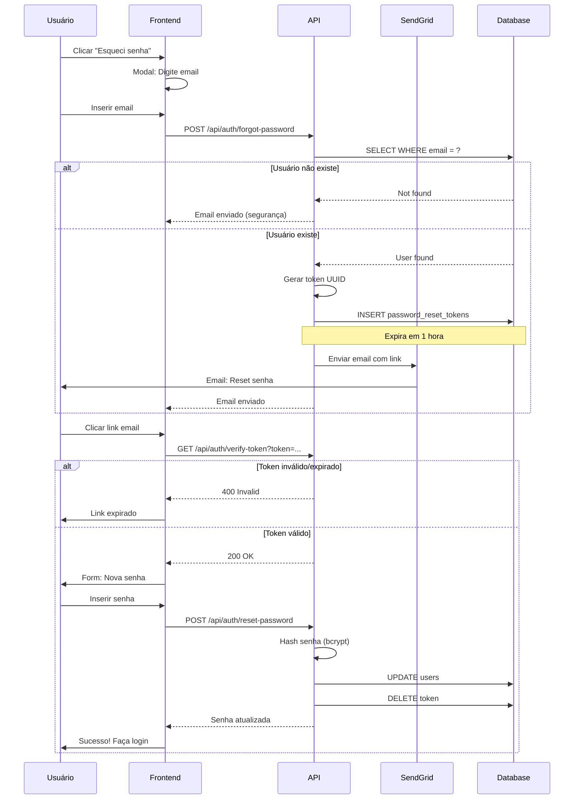

# 🛡️ Fluxos de Segurança - GoCasa360IT

**GDPR Compliance e Recuperação de Senha**

---

## 1. Fluxo de GDPR Consent

### 🎯 Objetivo
Coletar e gerenciar consentimento GDPR conforme regulamentação europeia.

### 📊 Diagrama

```mermaid
graph TD
    A[Registro Usuário] --> B[Formulário]
    B --> C[Checkboxes GDPR]
    C --> D[Necessário: checked obrigatório]
    C --> E[Marketing: opcional]
    C --> F[Analytics: opcional]
    C --> G[Third-party: opcional]
    
    G --> H{Aceitar Necessário?}
    H -->|Não| I[Bloquear Submit]
    I --> J[Erro: Consentimento obrigatório]
    
    H -->|Sim| K[POST /api/auth/register]
    K --> L[Salvar Usuário]
    L --> M[POST /api/gdpr/consent]
    M --> N[INSERT gdpr_consents]
    N --> O[Gravar IP, timestamp, purposes]
    O --> P[INSERT gdpr_consent_history]
    
    P --> Q[Email Confirmação]
    Q --> R[Link: Gerenciar Preferências]
    R --> S[/settings/privacy]
    S --> T[Toggle Preferências]
    T --> U[PUT /api/gdpr/consent]
    U --> P
```

### ✅ Purposes GDPR

| Purpose | Descrição | Obrigatório |
|---------|-----------|-------------|
| **Necessary** | Funcionamento básico | ✅ Sim |
| **Marketing** | Emails promocionais | ❌ Não |
| **Analytics** | Análise de uso (anônimo) | ❌ Não |
| **Third-party** | Compartilhamento com parceiros | ❌ Não |

---

## 2. Fluxo de Recuperação de Senha

### 🎯 Objetivo
Permitir reset seguro de senha via email com token temporário.

### 📊 Diagrama



### 🔐 Segurança

- ✅ Token único (UUID)
- ✅ Expira em 1 hora
- ✅ Uso único (deletado após reset)
- ✅ Resposta genérica (evitar enumeration)
- ✅ Rate limiting (5 tentativas/hora)

---

**Última atualização**: 28/12/2025  
**Versão**: 1.0
