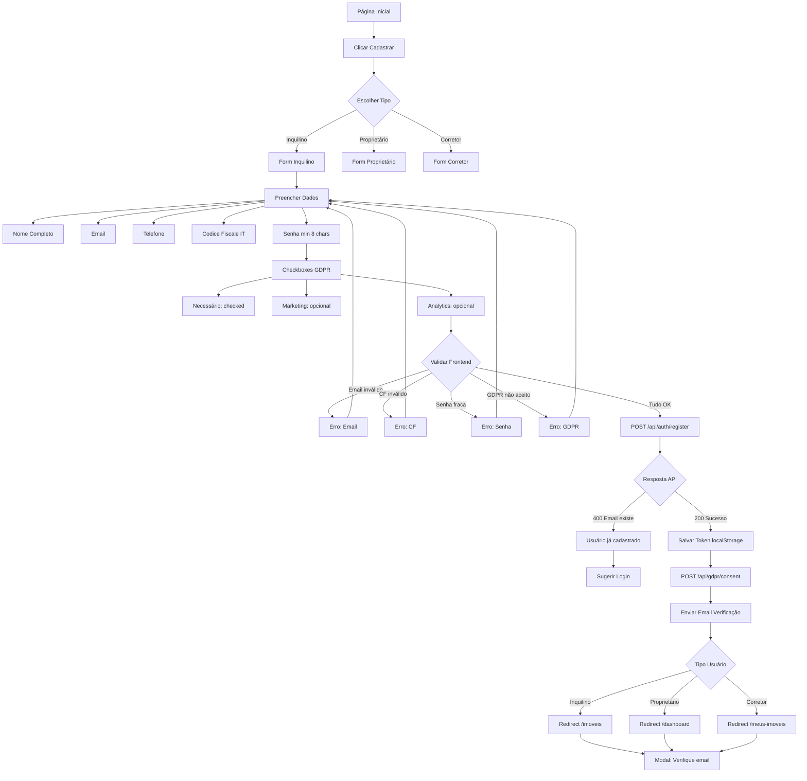
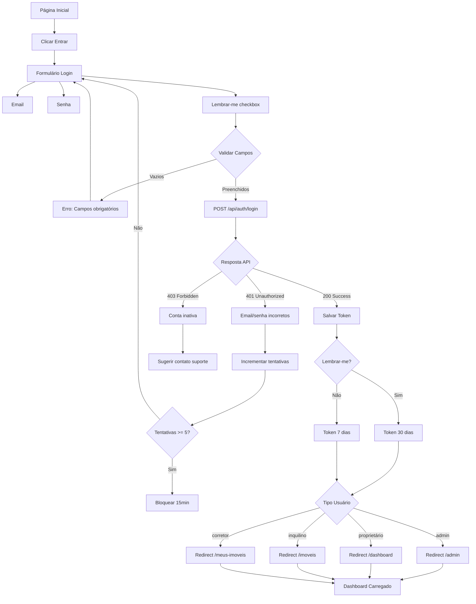
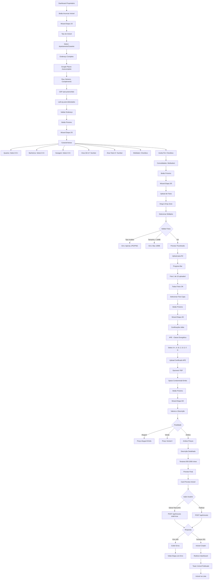
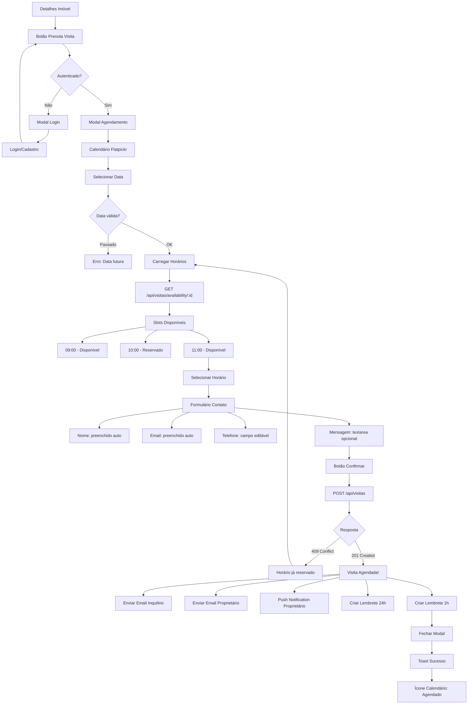
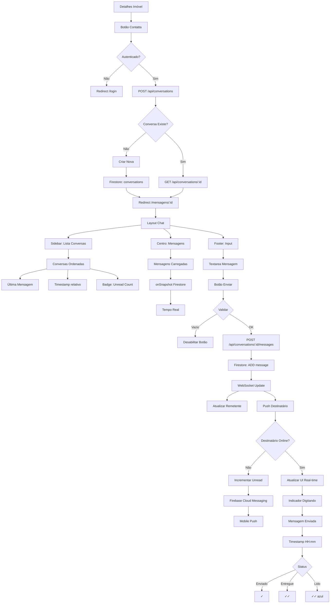
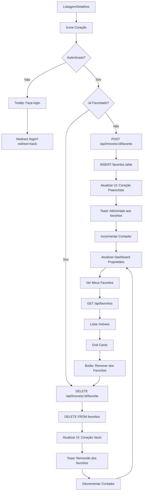

# 👥 Fluxos de Usuário - GoCasa360IT

**User Flows Completos para Definition of Ready (DoR)**

---

## 📋 Índice

1. [Fluxo de Registro/Cadastro](#1-fluxo-de-registrocadastro-inquilino)
2. [Fluxo de Login](#2-fluxo-de-login)
3. [Fluxo de Busca de Imóveis](#3-fluxo-de-busca-de-imóveis)
4. [Fluxo de Cadastro de Imóvel (Wizard)](#4-fluxo-de-cadastro-de-imóvel-wizard-5-etapas)
5. [Fluxo de Agendamento de Visita](#5-fluxo-de-agendamento-de-visita)
6. [Fluxo de Chat/Mensagens](#6-fluxo-de-chatmensagens)
7. [Fluxo de Favoritos](#7-fluxo-de-favoritos)
8. [Fluxo de Dashboard Proprietário](#8-fluxo-de-dashboard-proprietário)

---

## 1. Fluxo de Registro/Cadastro (Inquilino)

### 🎯 Objetivo
Permitir que novos usuários criem conta na plataforma com validação de dados e conformidade GDPR.

### 📊 Diagrama



### 📝 Campos do Formulário

| Campo | Tipo | Validação | Obrigatório |
|-------|------|-----------|-------------|
| **Nome Completo** | text | Min 3 chars | ✅ Sim |
| **Email** | email | Regex email válido | ✅ Sim |
| **Telefone** | tel | Formato italiano +39 | ✅ Sim |
| **Codice Fiscale** | text | Algoritmo CF (16 chars) | ✅ Sim |
| **Tipo** | select | inquilino/proprietário/corretor | ✅ Sim |
| **Senha** | password | Min 8, 1 maiúscula, 1 número | ✅ Sim |
| **Confirmar Senha** | password | Igual à senha | ✅ Sim |
| **GDPR Necessário** | checkbox | Deve estar checked | ✅ Sim |
| **GDPR Marketing** | checkbox | Opcional | ❌ Não |
| **GDPR Analytics** | checkbox | Opcional | ❌ Não |

### 🔐 API Endpoint

```typescript
POST /api/auth/register
Content-Type: application/json

{
  "nome_completo": "Mario Rossi",
  "email": "mario.rossi@example.it",
  "telefone": "+39 123 456 7890",
  "cpf_cnpj": "RSSMRA85M01H501Z", // Codice Fiscale
  "tipo": "inquilino",
  "senha": "Password123!",
  "gdpr_consent": {
    "necessary": true,
    "marketing": false,
    "analytics": true,
    "third_party": false
  }
}
```

### ✅ Critérios de Sucesso
- ✅ Validação de Codice Fiscale italiana
- ✅ Email único (verificar duplicatas)
- ✅ Senha segura (mínimo 8 caracteres, 1 maiúscula, 1 número)
- ✅ Consentimento GDPR registrado
- ✅ Email de verificação enviado
- ✅ Token JWT gerado e armazenado
- ✅ Redirecionamento baseado no tipo de usuário

### 🐛 Casos de Erro
| Erro | HTTP | Mensagem | Ação |
|------|------|----------|------|
| Email já existe | 400 | "Questo indirizzo email è già registrato" | Sugerir login |
| CF inválido | 400 | "Codice Fiscale non valido" | Re-validar campo |
| Senha fraca | 400 | "La password deve contenere almeno 8 caratteri" | Exibir requisitos |
| GDPR não aceito | 400 | "Devi accettare i termini obbligatori" | Destacar checkbox |

---

## 2. Fluxo de Login

### 🎯 Objetivo
Autenticar usuários existentes e redirecionar para área apropriada.

### 📊 Diagrama



### 📝 Campos do Formulário

| Campo | Tipo | Validação | Obrigatório |
|-------|------|-----------|-------------|
| **Email** | email | Regex email | ✅ Sim |
| **Senha** | password | Min 1 char | ✅ Sim |
| **Lembrar-me** | checkbox | Boolean | ❌ Não |

### 🔐 API Endpoint

```typescript
POST /api/auth/login
Content-Type: application/json

{
  "email": "mario.rossi@example.it",
  "senha": "Password123!"
}

// Response Success
{
  "success": true,
  "data": {
    "user": {
      "id": "user-001",
      "nome_completo": "Mario Rossi",
      "email": "mario.rossi@example.it",
      "tipo": "inquilino",
      "foto_perfil": "https://..."
    },
    "token": "eyJhbGciOiJIUzI1NiIsInR5cCI6IkpXVCJ9..."
  }
}
```

### ✅ Critérios de Sucesso
- ✅ Autenticação com email e senha
- ✅ Token JWT gerado (7 ou 30 dias)
- ✅ Proteção contra brute-force (5 tentativas)
- ✅ Redirecionamento baseado no role
- ✅ Persistência opcional (Lembrar-me)

### 🐛 Casos de Erro
| Erro | HTTP | Mensagem | Ação |
|------|------|----------|------|
| Credenciais inválidas | 401 | "Email o password non corretti" | Re-tentar |
| Conta inativa | 403 | "Account disattivato" | Contatar suporte |
| Muitas tentativas | 429 | "Troppi tentativi. Riprova tra 15 minuti" | Esperar |

---

## 3. Fluxo de Busca de Imóveis

### 🎯 Objetivo
Permitir busca e filtro de imóveis com UX intuitiva e resultados relevantes.

### 📊 Diagrama

```mermaid
graph TD
    A[Página Inicial] --> B[Barra de Busca]
    B --> C[Digite Localização]
    
    C --> D[Google Places Autocomplete]
    D --> E[Lista Sugestões]
    E --> F[Selecionar Endereço]
    
    F --> G[Abrir Filtros]
    G --> H[Tipo Imóvel]
    H --> I[Apartamento/Casa/Kitnet]
    
    G --> J[Finalidade]
    J --> K[Aluguel/Venda/Ambos]
    
    G --> L[Preço]
    L --> M[Slider Min/Max]
    
    G --> N[Quartos]
    N --> O[Dropdown 0-5+]
    
    G --> P[Área m²]
    P --> Q[Slider Range]
    
    G --> R[Comodidades]
    R --> S[Mobiliado checkbox]
    R --> T[Pet-friendly checkbox]
    R --> U[Garagem checkbox]
    
    U --> V[Aplicar Filtros]
    V --> W[GET /api/imoveis?filters]
    
    W --> X{Cache Redis?}
    X -->|Hit| Y[Retornar Cached]
    X -->|Miss| Z[Query Database]
    
    Z --> AA[Resultados SQL]
    AA --> AB[Salvar Cache 5min]
    AB --> AC{Tem Resultados?}
    
    AC -->|Não| AD[Nenhum imóvel encontrado]
    AD --> AE[Sugerir ampliar busca]
    
    AC -->|Sim| AF[Renderizar Grid]
    AF --> AG[Cards 3 Colunas Desktop]
    AG --> AH[Cards 1 Coluna Mobile]
    
    AH --> AI[Card Imóvel]
    AI --> AJ[Foto Capa]
    AI --> AK[Título]
    AI --> AL[Preço destaque]
    AI --> AM[Localização pin]
    AI --> AN[Características icons]
    AI --> AO[Botão Ver Detalhes]
    
    AO --> AP[Clicar Card]
    AP --> AQ[/imoveis/:id]
    
    AF --> AR[Ordenar Por]
    AR --> AS[Mais Recentes]
    AR --> AT[Menor Preço]
    AR --> AU[Maior Preço]
    AR --> AV[Mais Relevantes]
    
    AF --> AW[Paginação]
    AW --> AX[20 resultados/página]
    AX --> AY[Botões Próximo/Anterior]
```

### 🔍 Filtros Disponíveis

| Filtro | Tipo | Valores | Default |
|--------|------|---------|---------|
| **Localização** | autocomplete | Google Places | Nenhum |
| **Tipo** | multiselect | apartamento, casa, kitnet, cobertura | Todos |
| **Finalidade** | radio | aluguel, venda, ambos | Todos |
| **Preço Min** | number | 0 - 10.000.000 | 0 |
| **Preço Max** | number | 0 - 10.000.000 | ∞ |
| **Quartos** | select | 0, 1, 2, 3, 4, 5+ | Todos |
| **Banheiros** | select | 0, 1, 2, 3, 4, 5+ | Todos |
| **Área Min m²** | number | 0 - 1000 | 0 |
| **Área Max m²** | number | 0 - 1000 | ∞ |
| **Mobiliado** | checkbox | true/false | Ambos |
| **Pet-friendly** | checkbox | true/false | Ambos |
| **Garagem** | checkbox | true/false | Ambos |

### 🔐 API Endpoint

```typescript
GET /api/imoveis?
  cidade=Roma&
  tipo=apartamento,casa&
  finalidade=aluguel&
  preco_min=500&
  preco_max=2000&
  quartos=2&
  mobiliado=true&
  page=1&
  limit=20&
  order_by=created_at&
  order_dir=DESC

// Response
{
  "success": true,
  "data": {
    "imoveis": [...],
    "pagination": {
      "total": 156,
      "page": 1,
      "limit": 20,
      "pages": 8
    }
  }
}
```

### ✅ Critérios de Sucesso
- ✅ Autocomplete de endereços (Google Places)
- ✅ Filtros múltiplos combinados (AND logic)
- ✅ Cache de resultados (5 minutos)
- ✅ Paginação (20 resultados)
- ✅ Ordenação múltipla
- ✅ Responsivo (grid 3→1 colunas)
- ✅ Cards com informações essenciais

---

## 4. Fluxo de Cadastro de Imóvel (Wizard 5 Etapas)

### 🎯 Objetivo
Permitir que proprietários cadastrem imóveis de forma guiada e intuitiva.

### 📊 Diagrama Completo



### 📝 Etapas Detalhadas

#### **Etapa 1/5: Tipo e Endereço**

| Campo | Tipo | Validação | Obrigatório |
|-------|------|-----------|-------------|
| Tipo Imóvel | select | 7 opções | ✅ Sim |
| Endereço | autocomplete | Google Places | ✅ Sim |
| Número | text | Numérico | ✅ Sim |
| Complemento | text | Opcional | ❌ Não |
| Bairro | text | Auto-preenchido | ✅ Sim |
| Cidade | text | Auto-preenchido | ✅ Sim |
| CEP | text | Formato italiano | ✅ Sim |
| Latitude | hidden | Auto-detectado | ✅ Sim |
| Longitude | hidden | Auto-detectado | ✅ Sim |

#### **Etapa 2/5: Características**

| Campo | Tipo | Validação | Obrigatório |
|-------|------|-----------|-------------|
| Quartos | select | 0-5+ | ✅ Sim |
| Banheiros | select | 0-5+ | ✅ Sim |
| Vagas Garagem | select | 0-5+ | ✅ Sim |
| Área Útil m² | number | > 0 | ✅ Sim |
| Área Total m² | number | >= Área Útil | ❌ Não |
| Mobiliado | checkbox | Boolean | ❌ Não |
| Aceita Pet | checkbox | Boolean | ❌ Não |
| Comodidades | multiselect | Lista fixa | ❌ Não |

**Comodidades disponíveis:**
- Piscina, Academia, Churrasqueira, Portaria 24h
- Salão de Festas, Playground, Quadra Esportiva
- Elevador, Interfone, Segurança, CCTV

#### **Etapa 3/5: Upload de Fotos**

| Campo | Tipo | Validação | Obrigatório |
|-------|------|-----------|-------------|
| Fotos | file[] | JPG/PNG, max 10MB cada | ✅ Min 3 fotos |
| Foto Capa | radio | Uma das fotos | ✅ Sim |

**Regras:**
- Mínimo 3 fotos, máximo 20
- Formatos: JPG, JPEG, PNG
- Tamanho máximo: 10MB por foto
- Upload direto para Cloudflare R2 (presigned URL)
- Preview thumbnails 200x150px

#### **Etapa 4/5: Certificações**

| Campo | Tipo | Validação | Obrigatório |
|-------|------|-----------|-------------|
| APE Classe | select | A+ até G | ⚠️ Recomendado |
| Certificado APE | file | PDF max 5MB | ❌ Não |
| Spese Condominiali | number | >= 0 | ❌ Não |

#### **Etapa 5/5: Valores e Revisão**

| Campo | Tipo | Validação | Obrigatório |
|-------|------|-----------|-------------|
| Finalidade | radio | Aluguel/Venda/Ambos | ✅ Sim |
| Preço Aluguel | number | > 0 se Aluguel | Condicional |
| Preço Venda | number | > 0 se Venda | Condicional |
| Descrição | textarea | 500-2000 chars | ✅ Sim |

### 🔐 API Endpoint

```typescript
POST /api/imoveis
Content-Type: application/json

{
  "tipo": "apartamento",
  "titulo": "Apartamento Moderno em Roma Centro",
  "descricao": "Lindo apartamento totalmente mobiliado...",
  "finalidade": "aluguel",
  "preco_aluguel": 1500,
  "preco_venda": null,
  "endereco_rua": "Via del Corso",
  "endereco_numero": "123",
  "endereco_bairro": "Centro Storico",
  "endereco_cidade": "Roma",
  "endereco_estado": "Lazio",
  "endereco_cep": "00186",
  "endereco_latitude": 41.9028,
  "endereco_longitude": 12.4964,
  "quartos": 2,
  "banheiros": 1,
  "vagas_garagem": 0,
  "area_util": 65,
  "mobiliado": true,
  "pet_friendly": false,
  "comodidades": ["Elevador", "Portaria 24h"],
  "fotos": [
    "https://r2.../foto1.jpg",
    "https://r2.../foto2.jpg"
  ],
  "foto_capa": "https://r2.../foto1.jpg",
  "ape_classe": "B",
  "condominio": 150
}
```

### ✅ Critérios de Sucesso
- ✅ Wizard navegável (Voltar/Próximo)
- ✅ Validação por etapa (não avança se inválido)
- ✅ Autocomplete de endereços (Google Places)
- ✅ Upload múltiplo de fotos (R2)
- ✅ Preview antes de publicar
- ✅ Salvar rascunho (draft)
- ✅ Progresso visual (1/5, 2/5, etc)

---

## 5. Fluxo de Agendamento de Visita

### 🎯 Objetivo
Permitir que inquilinos agendem visitas aos imóveis de forma simples.

### 📊 Diagrama



### 📝 Campos do Modal

| Campo | Tipo | Validação | Obrigatório |
|-------|------|-----------|-------------|
| Data | datepicker | Futuro, max 90 dias | ✅ Sim |
| Horário | radio | Slots disponíveis | ✅ Sim |
| Nome | text | Auto-preenchido (readonly) | ✅ Sim |
| Email | email | Auto-preenchido (readonly) | ✅ Sim |
| Telefone | tel | Formato italiano | ✅ Sim |
| Mensagem | textarea | Max 500 chars | ❌ Não |

### 🔐 API Endpoints

#### Verificar Disponibilidade
```typescript
GET /api/visitas/availability/:imovel_id?data=2025-01-15

// Response
{
  "success": true,
  "data": {
    "slots": [
      {"hora": "09:00", "disponivel": true},
      {"hora": "10:00", "disponivel": false},
      {"hora": "11:00", "disponivel": true}
    ]
  }
}
```

#### Agendar Visita
```typescript
POST /api/visitas
Content-Type: application/json

{
  "imovel_id": "imovel-001",
  "data_hora": "2025-01-15T10:00:00Z",
  "observacoes": "Prefiro visitar pela manhã"
}

// Response
{
  "success": true,
  "data": {
    "id": "visita-123",
    "status": "pendente",
    "proprietario": {
      "nome": "João Silva",
      "telefone": "+39 123 456 789"
    }
  }
}
```

### ✅ Critérios de Sucesso
- ✅ Calendário visual (Flatpickr)
- ✅ Slots de horário dinâmicos
- ✅ Prevenção de double booking (locks)
- ✅ Emails automáticos (inquilino + proprietário)
- ✅ Lembretes automáticos (24h e 1h antes)
- ✅ Push notification para proprietário

---

## 6. Fluxo de Chat/Mensagens

### 🎯 Objetivo
Facilitar comunicação em tempo real entre inquilinos e proprietários.

### 📊 Diagrama



### 📝 Interface do Chat

| Componente | Descrição |
|------------|-----------|
| **Sidebar** | Lista de conversas (mais recentes primeiro) |
| **Header** | Nome do contato + foto perfil + status online |
| **Body** | Mensagens (scroll automático para última) |
| **Input** | Textarea + botão enviar + anexo (futuro) |
| **Status** | ✓ enviado, ✓✓ entregue, ✓✓ lido |

### 🔐 API Endpoints

#### Criar/Buscar Conversa
```typescript
POST /api/conversations
{
  "imovel_id": "imovel-001",
  "destinatario_id": "user-002"
}

// Response
{
  "id": "conv-123",
  "participants": ["user-001", "user-002"],
  "imovel_id": "imovel-001",
  "created_at": "2025-01-15T10:00:00Z"
}
```

#### Enviar Mensagem
```typescript
POST /api/conversations/:id/messages
{
  "content": "Olá, tenho interesse nesse imóvel"
}

// Firestore Document
{
  "id": "msg-456",
  "sender_id": "user-001",
  "content": "Olá, tenho interesse...",
  "is_read": false,
  "created_at": Timestamp
}
```

### ✅ Critérios de Sucesso
- ✅ Mensagens em tempo real (Firestore onSnapshot)
- ✅ Indicador "digitando..." (typing indicator)
- ✅ Status de leitura (✓, ✓✓, ✓✓ azul)
- ✅ Push notifications offline
- ✅ Badge de mensagens não lidas
- ✅ Histórico de conversas

---

## 7. Fluxo de Favoritos

### 🎯 Objetivo
Permitir que usuários salvem imóveis para consulta posterior.

### 📊 Diagrama



### 🔐 API Endpoints

```typescript
// Adicionar aos Favoritos
POST /api/imoveis/:id/favorite

// Remover dos Favoritos
DELETE /api/imoveis/:id/favorite

// Listar Meus Favoritos
GET /api/favoritos
// Response
{
  "success": true,
  "data": {
    "favoritos": [
      {
        "imovel_id": "imovel-001",
        "titulo": "Apartamento...",
        "preco_aluguel": 1500,
        "foto_capa": "...",
        "favoritado_em": "2025-01-15T10:00:00Z"
      }
    ]
  }
}
```

### ✅ Critérios de Sucesso
- ✅ Toggle favorito (coração vazio/cheio)
- ✅ Proteção: apenas autenticados
- ✅ Feedback visual imediato
- ✅ Página /favoritos com lista completa
- ✅ Contador de favoritos no dashboard proprietário

---

## 8. Fluxo de Dashboard Proprietário

### 🎯 Objetivo
Centralizar gestão de imóveis e métricas para proprietários.

### 📊 Diagrama

```mermaid
graph TD
    A[Login Proprietário] --> B[Redirect /dashboard]
    B --> C[GET /api/imoveis?proprietario_id=me]
    C --> D[GET /api/dashboard/metrics]
    
    D --> E[Layout Dashboard]
    E --> F[Header: Bem-vindo Nome]
    E --> G[Cards Métricas]
    
    G --> H[Total Imóveis]
    H --> I[Badge: Número]
    G --> J[Visualizações 30d]
    J --> K[Chart: Trend]
    G --> L[Favoritos Totais]
    L --> M[Badge: Número]
    G --> N[Visitas Agendadas]
    N --> O[Badge: Próximas]
    G --> P[Mensagens Não Lidas]
    P --> Q[Badge: Red Dot]
    
    Q --> R[Botão: Anunciar Imóvel]
    R --> S[Wizard Cadastro]
    
    E --> T[Tabela/Grid Imóveis]
    T --> U[Cada Imóvel Card]
    U --> V[Foto Capa]
    U --> W[Título Truncado]
    U --> X[Status Badge]
    X --> Y[Ativo Verde]
    X --> Z[Pausado Amarelo]
    X --> AA[Rascunho Cinza]
    
    U --> AB[Métricas Mini]
    AB --> AC[Views Icon + Número]
    AB --> AD[Favorites Icon + Número]
    AB --> AE[Messages Icon + Número]
    
    U --> AF[Dropdown Ações]
    AF --> AG[Ver Detalhes]
    AF --> AH[Editar]
    AF --> AI[Pausar/Reativar]
    AF --> AJ[Excluir]
    
    AG --> AK[/imoveis/:id]
    AH --> AL[Wizard Edição]
    AI --> AM[PUT /api/imoveis/:id]
    AM --> AN{Novo Status}
    AN -->|Pausado| AO[Status: pausado]
    AN -->|Ativo| AP[Status: disponivel]
    
    AJ --> AQ{Confirmar Exclusão?}
    AQ -->|Não| U
    AQ -->|Sim| AR[DELETE /api/imoveis/:id]
    AR --> AS[Remove da Lista]
    AS --> AT[Toast: Imóvel Excluído]
    
    E --> AU[Seção: Visitas Próximas]
    AU --> AV[Lista de Visitas]
    AV --> AW[Data/Hora]
    AV --> AX[Nome Inquilino]
    AV --> AY[Imóvel]
    AV --> AZ[Botão: Confirmar]
    AV --> BA[Botão: Cancelar]
```

### 📊 Métricas do Dashboard

| Métrica | Descrição | Fonte |
|---------|-----------|-------|
| **Total Imóveis** | Quantidade de anúncios ativos | COUNT(imoveis WHERE status='disponivel') |
| **Visualizações 30d** | Soma de views últimos 30 dias | SUM(visualizacoes WHERE date >= NOW() - 30d) |
| **Favoritos** | Total de favoritos em todos imóveis | COUNT(favoritos WHERE imovel_id IN my_properties) |
| **Visitas Agendadas** | Próximas visitas (futuras) | COUNT(visitas WHERE date >= TODAY) |
| **Mensagens Não Lidas** | Conversas com mensagens não lidas | COUNT(messages WHERE is_read=false) |

### 🔐 API Endpoints

```typescript
// Métricas Dashboard
GET /api/dashboard/metrics

// Response
{
  "total_imoveis": 12,
  "visualizacoes_30d": 456,
  "favoritos_total": 34,
  "visitas_agendadas": 5,
  "mensagens_nao_lidas": 3,
  "chart_views": [
    {"date": "2025-01-01", "views": 23},
    {"date": "2025-01-02", "views": 45}
  ]
}

// Meus Imóveis
GET /api/imoveis?proprietario_id=me&include_drafts=true

// Pausar/Reativar
PUT /api/imoveis/:id
{
  "status": "pausado" // ou "disponivel"
}
```

### ✅ Critérios de Sucesso
- ✅ Cards de métricas com números em destaque
- ✅ Lista de imóveis com ações (ver, editar, pausar, excluir)
- ✅ Status visual (verde, amarelo, cinza)
- ✅ Botão destacado "Anunciar Imóvel"
- ✅ Próximas visitas agendadas
- ✅ Link rápido para mensagens não lidas

---

## 📊 Resumo de Fluxos

| # | Fluxo | Prioridade | Status | Diagramas |
|---|-------|------------|--------|-----------|
| 1 | Registro/Cadastro | 🔥 CRÍTICA | ❌ A implementar | 1 Mermaid |
| 2 | Login | 🔥 CRÍTICA | ❌ A implementar | 1 Mermaid |
| 3 | Busca Imóveis | 🔥 CRÍTICA | ❌ A implementar | 1 Mermaid |
| 4 | Cadastro Imóvel (Wizard) | 🔥 CRÍTICA | ❌ A implementar | 1 Mermaid |
| 5 | Agendamento Visita | 🔥 ALTA | ❌ A implementar | 1 Mermaid |
| 6 | Chat/Mensagens | 🔥 ALTA | ❌ A implementar | 1 Mermaid |
| 7 | Favoritos | 🟡 MÉDIA | ❌ A implementar | 1 Mermaid |
| 8 | Dashboard Proprietário | 🔥 ALTA | ❌ A implementar | 1 Mermaid |

**Total**: 8 diagramas Mermaid completos

---

## 🔗 Documentos Relacionados

- [DoR Analysis](./DoR_ANALISE.md) - Análise completa de gaps
- [Fluxos de Integração](./FLUXOS_INTEGRACAO.md) - APIs externas
- [Fluxos de Segurança](./FLUXOS_SEGURANCA.md) - GDPR e auth
- [Fluxos de Dados](./FLUXOS_DADOS.md) - Data processing
- [Arquitetura](./ARQUITETURA_MICROSERVICOS.md) - Backend services

---

**Última atualização**: 28/12/2025  
**Versão**: 1.0  
**Próxima ação**: Implementar fluxos críticos (Wizard, Upload, Maps)
