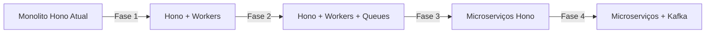

# Stack Tecnológico - Plataforma Proptech

**Comparação QuintoAndar vs GoCasa360IT**

---

## 📚 Stack do QuintoAndar (Referência)

### Frontend

| Camada | Tecnologia | Justificativa |
|--------|------------|---------------|
| **Web** | React + Next.js | SSR para SEO, PWA capabilities, ecossistema maduro |
| **Mobile** | Flutter | Código compartilhado iOS/Android, performance nativa |
| **Design System** | Componentes proprietários + Material Design | Consistência visual, componentes reutilizáveis |
| **State Management** | Redux ou Context API | Gerenciamento de estado previsível |
| **Estilização** | Styled Components ou CSS-in-JS | Componentes isolados, temas dinâmicos |

### Backend

| Camada | Tecnologia | Justificativa |
|--------|------------|---------------|
| **Linguagens** | Java, Kotlin (microserviços), Python (AI/ML) | Escalabilidade, tipagem forte, ecossistema robusto |
| **Frameworks** | Spring Boot (Java), FastAPI (Python) | Produtividade, DI, ecosistema de libs |
| **API Gateway** | Kong ou AWS API Gateway | Roteamento, rate limiting, autenticação |
| **Mensageria** | Apache Kafka / Google Pub/Sub | Event-driven, desacoplamento, replay |
| **Cache** | Redis | Performance, sessões, filas |
| **Search** | Elasticsearch | Busca full-text, filtros complexos, geo-queries |

### Banco de Dados

| Tipo | Tecnologia | Uso |
|------|------------|-----|
| **Relacional** | PostgreSQL | Dados transacionais (users, properties, bookings) |
| **NoSQL** | Firestore | Mensagens, notificações, dados em tempo real |
| **Cache** | Redis | Sessions, cache de queries, rate limiting |
| **Search** | Elasticsearch | Busca full-text de imóveis |

### Infraestrutura

| Camada | Tecnologia | Justificativa |
|--------|------------|---------------|
| **Cloud** | Google Cloud Platform (principal) | Escalabilidade, serviços gerenciados, AI/ML |
| **Containers** | Docker + Kubernetes | Portabilidade, orquestração, auto-scaling |
| **CDN** | Google Cloud CDN | Performance global, cache de assets |
| **Object Storage** | Cloud Storage | Fotos, vídeos, documentos |
| **Serverless** | Cloud Functions | Processamento de imagens, webhooks |

### Dados e Analytics

| Camada | Tecnologia | Uso |
|--------|------------|-----|
| **Data Lake** | Cloud Storage (raw, clean, enriched) | Armazenamento escalável |
| **Processamento** | Apache Spark / Databricks (PySpark) | ETL, transformações |
| **Data Warehouse** | BigQuery | Analytics, BI, relatórios |
| **Orquestração** | Apache Airflow / Cloud Composer | Pipelines de dados agendados |
| **BI** | Looker, Metabase | Dashboards, análises self-service |

### DevOps e Observabilidade

| Camada | Tecnologia | Uso |
|--------|------------|-----|
| **CI/CD** | GitHub Actions, Fastlane (mobile) | Automação de build e deploy |
| **Monitoramento** | Datadog, Grafana, Prometheus | Métricas, dashboards, alertas |
| **Logs** | ELK Stack (Elasticsearch, Logstash, Kibana) | Centralização, busca, análise |
| **APM** | Datadog ou New Relic | Performance, tracing distribuído |
| **Error Tracking** | Sentry | Crash reporting, stack traces |

### Serviços Externos

| Serviço | Provider | Uso |
|---------|----------|-----|
| **Mapas** | Google Maps Platform | Geocoding, Maps SDK, Places API |
| **Autenticação** | Firebase Auth | Social login (Google, Apple) |
| **Notificações** | Firebase Cloud Messaging, Twilio | Push, SMS, WhatsApp |
| **Pagamentos** | Stripe, Adyen | Gateway, checkout, payouts |
| **Analytics** | Google Analytics, Mixpanel | User tracking, funnels |

---

## 🏗️ Stack do GoCasa360IT (Atual)

### Frontend

| Camada | Tecnologia Atual | Status |
|--------|------------------|--------|
| **Web** | Hono + TypeScript + TailwindCSS | ✅ Implementado |
| **Mobile** | ❌ Não implementado | 🔴 Pendente |
| **Design System** | TailwindCSS + componentes inline | ⚠️ Básico |
| **State Management** | Vanilla JavaScript | ⚠️ Limitado |
| **Estilização** | TailwindCSS CDN | ✅ Funcional |

### Backend

| Camada | Tecnologia Atual | Status |
|--------|------------------|--------|
| **Linguagem** | TypeScript/JavaScript | ✅ Implementado |
| **Framework** | Hono (edge-first) | ✅ Implementado |
| **API Gateway** | Hono routing | ✅ Básico |
| **Mensageria** | ❌ Não implementado | 🔴 Pendente |
| **Cache** | ❌ Não implementado | 🔴 Pendente |
| **Search** | SQL queries básicas | ⚠️ Limitado |

### Banco de Dados

| Tipo | Tecnologia Atual | Status |
|------|------------------|--------|
| **Relacional** | Cloudflare D1 (SQLite) | ✅ Implementado |
| **NoSQL** | ❌ Não implementado | 🔴 Pendente |
| **Cache** | ❌ Não implementado | 🔴 Pendente |
| **Search** | SQL LIKE queries | ⚠️ Limitado |

### Infraestrutura

| Camada | Tecnologia Atual | Status |
|--------|------------------|--------|
| **Cloud** | Cloudflare Pages/Workers | ✅ Implementado |
| **Containers** | ❌ Não aplicável (serverless) | ➖ N/A |
| **CDN** | Cloudflare CDN (built-in) | ✅ Automático |
| **Object Storage** | ❌ Não implementado (usar R2) | 🔴 Pendente |
| **Serverless** | Cloudflare Workers (nativo) | ✅ Implementado |

### Serviços Externos

| Serviço | Provider Atual | Status |
|---------|----------------|--------|
| **Mapas** | ❌ Não integrado | 🔴 Pendente |
| **Autenticação** | JWT manual | ⚠️ Básico |
| **Notificações** | ❌ Não implementado | 🔴 Pendente |
| **Pagamentos** | ❌ Não implementado | 🔴 Pendente |
| **Analytics** | ❌ Não implementado | 🔴 Pendente |

---

## 🔄 Stack Recomendado para GoCasa360IT

### Fase 1: MVP (Próximos 3 meses)

#### Frontend
```typescript
// Manter stack atual + melhorias
✅ Hono + TypeScript (backend)
✅ TailwindCSS (estilização)
➕ Alpine.js ou Vanilla JS modular (interatividade)
➕ Componentes web reutilizáveis
```

#### Backend
```typescript
✅ Hono (atual)
➕ Cloudflare Workers (edge compute)
➕ Cloudflare D1 (SQLite distribuído)
➕ Cloudflare KV (cache simples)
➕ Cloudflare R2 (object storage para fotos)
```

#### Integrações Essenciais MVP
```
🔴 ALTA PRIORIDADE:
- Google Maps Platform (busca, geocoding, mapa)
- SendGrid ou Mailgun (emails transacionais)
- Twilio (SMS para verificação)

🟡 MÉDIA PRIORIDADE:
- Stripe ou Mercado Pago (pagamentos)
- Firebase Auth (login social)
- Cloudflare Images (otimização de fotos)

🟢 BAIXA PRIORIDADE (Pós-MVP):
- Analytics (Google Analytics, Plausible)
- Error tracking (Sentry)
- Monitoring (Better Stack, Axiom)
```

### Fase 2: Crescimento (Meses 4-9)

#### Mobile
```
Opções:
1. Progressive Web App (PWA) - continuar web
2. Flutter (compartilhar lógica de negócio)
3. React Native (se migrar web para React)

Recomendação: PWA primeiro (custo-benefício)
```

#### Backend Avançado
```
Migração gradual:
D1 → PostgreSQL (Neon, Supabase)
KV → Redis (Upstash)
Workers → Microserviços Node.js/Hono
```

#### Mensageria
```
Opções leves:
- Cloudflare Queues (simples, integrado)
- Upstash Kafka (serverless)
- AWS SQS (se já usar AWS)
```

#### Search
```
Migração gradual:
SQL LIKE → PostgreSQL Full-Text Search
→ Algolia (managed, rápido)
→ Elasticsearch (self-hosted, mais controle)
```

---

## 📊 Comparação de Custos

### QuintoAndar (Estimado)

```
Infrastructure (GCP):       $50k-$100k/mês
Third-party services:       $20k-$50k/mês
Team (80-150 people):       $500k-$1M/mês
Total:                      $570k-$1.15M/mês
```

### GoCasa360IT MVP (Atual)

```
Cloudflare Pages:           $0-$20/mês (Free tier adequado)
Cloudflare Workers:         $5/mês (paid plan)
D1 Database:                $0 (incluído)
Third-party (estimado):     $0-$100/mês
Team (1-3 pessoas):         $5k-$15k/mês
Total:                      $5k-$15k/mês
```

### GoCasa360IT Fase 2 (Crescimento)

```
Infrastructure:             $200-$500/mês
Third-party services:       $500-$2k/mês
Team (5-10 pessoas):        $30k-$60k/mês
Total:                      $30k-$62k/mês
```

---

## 🎯 Recomendações Estratégicas

### 1. Manter Cloudflare Workers para MVP
**Vantagens:**
- ✅ Custo baixo ($5-$20/mês)
- ✅ Escalabilidade automática
- ✅ Edge computing (latência baixa)
- ✅ Simplicidade de deploy

**Limitações:**
- ⚠️ 10ms CPU limit (free), 30ms (paid)
- ⚠️ Sem suporte a WebSockets nativos
- ⚠️ Ecosistema menor que AWS/GCP

### 2. Integrar Google Maps ASAP
**Essencial para:**
- Busca por localização (autocomplete)
- Geocoding (endereço → lat/lng)
- Mapa interativo
- Cálculo de proximidade

**Custo estimado:**
- $0-$200/mês (até 100k requests)

### 3. Adicionar Sistema de Mensagens
**Opções para MVP:**

| Opção | Custo | Complexidade | Recomendação |
|-------|-------|--------------|--------------|
| Firebase Firestore | $0-$50/mês | Baixa | ⭐ Melhor para MVP |
| Cloudflare Durable Objects | $5/mês | Média | Boa opção serverless |
| PostgreSQL + Polling | $0-$20/mês | Alta | Evitar |

### 4. Implementar Upload de Fotos
**Recomendação: Cloudflare R2 + Images**

```typescript
// Fluxo de upload
1. Frontend → Upload direto para R2 (presigned URL)
2. Cloudflare Images → Otimização automática
3. CDN → Entrega rápida global

Custo:
- R2 Storage: $0.015/GB/mês
- R2 Operations: $4.50/milhão
- Images: $5/mês + $1/100k transformations
```

### 5. Migração Gradual para Microserviços (Futuro)



**Timeline:**
- Fase 1: MVP (mês 0-3)
- Fase 2: Crescimento (mês 4-9)
- Fase 3: Escala (mês 10-18)
- Fase 4: Maturidade (ano 2+)

---

## 🛠️ Ferramentas de Desenvolvimento

### Atuais (GoCasa360IT)
```
✅ Vite (build tool)
✅ TypeScript (type safety)
✅ Wrangler (Cloudflare CLI)
✅ Git + GitHub (version control)
✅ PM2 (local development)
```

### Recomendadas para Adicionar
```
🔴 ALTA PRIORIDADE:
- ESLint + Prettier (code quality)
- Vitest ou Jest (unit tests)
- Playwright (e2e tests)
- Husky (pre-commit hooks)

🟡 MÉDIA PRIORIDADE:
- Storybook (component library)
- GitHub Actions (CI/CD)
- Sentry (error tracking)
- Plausible/Fathom (analytics privacy-first)

🟢 BAIXA PRIORIDADE:
- Turborepo (monorepo, se crescer)
- Changesets (versioning)
- Dependabot (dependency updates)
```

---

## 🔗 Documentos Relacionados

- [Arquitetura de Microserviços](./ARQUITETURA_MICROSERVICOS.md)
- [CI/CD Pipeline](./CI_CD_PIPELINE.md)
- [Proptech Workflow](./PROPTECH_WORKFLOW.md)
- [Comparação GoCasa360](./COMPARACAO_GOCASA360.md)

---

## 📚 Recursos e Links Úteis

### Cloudflare
- [Cloudflare Workers Docs](https://developers.cloudflare.com/workers/)
- [D1 Database Docs](https://developers.cloudflare.com/d1/)
- [R2 Storage Docs](https://developers.cloudflare.com/r2/)
- [Hono Framework](https://hono.dev/)

### QuintoAndar Tech Blog
- [StackShare Profile](https://stackshare.io/quintoandar/quintoandar)
- [Medium Tech Blog](https://medium.com/quintoandar-tech-blog)
- [Data Architecture Evolution](https://medium.com/quintoandar-tech-blog/from-traditional-bi-to-lake-house-a-data-architecture-evolution-636f4fdaedf2)

### Best Practices
- [12 Factor App](https://12factor.net/)
- [Team Topologies](https://teamtopologies.com/)
- [Microservices Patterns](https://microservices.io/patterns/index.html)
